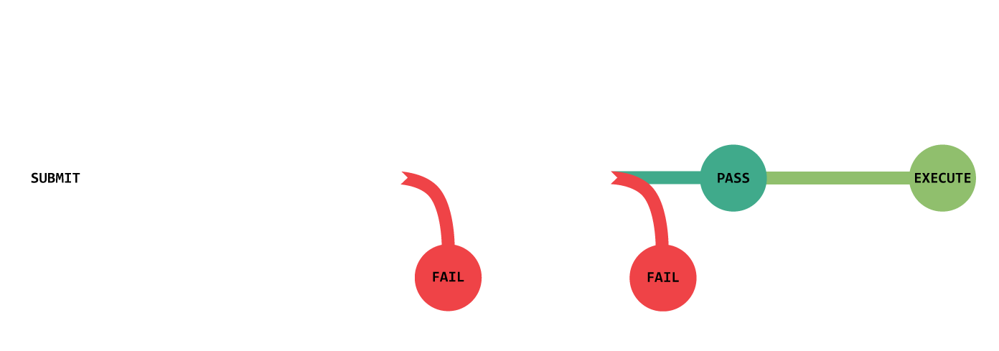

# The Citadel DAO

## Vision

The Citadel DAO empowers a community of passionate players to have fun building and inhabiting an on-chain persistent world they own together. 

## Values

- **Decentralization**: we stand for a decentralized, community governed metaverse.
- **Sustainability**: our decisions are guided by a long-term view of the game, community, and economy.   
- **Experimentation**: we reserve the freedom to be bold, to try new things, and iterate rapidly. 
- **Positive sum**: we prefer win-win outcomes and relationships.
- **Integrity**: we keep our word, we tell the truth, we do the right thing. 
- **People first**: we prioritize the wellbeing of the community above all competing interests.  
- **Transparency**: information about all aspects of the project is clear and accessible. 

## Eligibility

In order to participate in governance you must have at least one $BADGE token in your wallet. $BADGE tokens are created by staking a ship into the game and are burned by unstaking a ship from the game. You may delegate the voting power of a $BADGE token to another pilot, and may also reclaim the delegated voting power at any time.   

## Voting

Governance takes place fully on-chain via custom contracts based on OpenZeppelin's `Governor`, `Timelock`, and `ERC20Votes`. Tally provides the front-end user interface and makes participating in governance intuitive and simple. 

### [How to view active and recent proposals](https://docs.tally.xyz/user-guides/navigating-the-app/governance-page) 
### [How to vote on an active proposal](https://docs.tally.xyz/user-guides/vote-on-an-active-proposal)
### [How to delegate voting power](https://docs.tally.xyz/user-guides/delegate-votes)

## Proposals

Anyone with 5 ships worth of voting power (via ship ownership or delegation) can submit a proposal. Proposals that don't follow guidelines are subject to being vetoed by the team. The team's veto power can be removed by activating a pre-written proposal to remove the veto power which is immune from being vetoed. 

Once submitted, proposals become active and enter a 6-7 day voting period. In order to pass, a proposal must reach quorum as well as be majority (51%+) in favor. To reach quorum, at least 4% of total voting power must vote on the proposal. After a proposal passes there is a 2 day delay before the execution of any code that was contained in the proposal. This 2 day "timelock" period allows those who may disagree with the proposal to exit the project before the changes take effect. 

### [How to submit a proposal on Tally](https://docs.tally.xyz/user-guides/create-a-proposal)

### Proposal Categories
   - **Game**: features, balancing, creative
   - **Governance**: contracts, process, structure, rules, requirements
   - **Community**: rewarding contributions, role creation/assignment, events
   - **Information**: documentation, educational resources, web updates
   - **Brand**: collabs, tools / web apps dev, ecosystem expansion

### Proposal Types: 
   - **Funding allocation**: any proposal that asks for a treasury disbursement, including proposals pitching work to be done. 
   - **Contract upgrade**: the implementation follow-up to a successful funding allocation proposal involving a contract upgrade. The relevant contracts are upgraded and final compensation is disbursed (if requested) after passing. 
   - **Resolution**: no code to execute, purely a symbolic decision (mission statement, values, community rules, discord roles, etc). 

### Proposal Requirements  
   - Must have at least 5 ships worth of voting power. This can be a combination of ships staked directly and votes delegated by other pilots. 
   - Must conform to the proposal template guidelines.
   - Must be realistic, narrowly scoped, detailed, and reasonably budgeted.
   - All contract upgrades must pass a Solidity Finance code audit. 
   - All game contract upgrades that have economic or balance implications must pass a Machinations audit. 

### The Proposal Process

#### **For a contract upgrade** (game and governance related proposals)
1. **Submit initial funding allocation proposal** pitching the changes or features to be developed. Even if self funding, this initial proposal is standard practice to get community buy-in before proceeding to requesting an audit. 
2. **Submit completed code to audit partner(s)** with written explanation of expected impact to get quotes on cost of audits.
3. **Submit funding allocation proposal for audit(s)** that includes the audit cost quotes.  The proposal will send funds directly to audit partner(s) if passed. 
4. **Submit a contract upgrade proposal** with code that has passed audit(s) and request final compensation if necessary. This proposal will upgrade the relevant contracts and disburse any requested funds if passed.

#### **For another use of treasury funds** (most other proposals)
1. Submit a funding allocation proposal. Funds will be disbursed if passed. In the case of compensation for work to be done, funds requested should be a partial amount of total compensation, where the rest is paid after work is complete.
2. (Optional) If the initial proposal was partial compensation for work to be done, submit a followup funding allocation proposal showing the completed work and request the remaining portion of total compensation quoted in the initial proposal. 

#### **For a community resolution** (no funds requested, no code is executed)
- Submit a resolution proposal. No code is executed if passed, and it's up to appropriate appointed members of the core team or DAO to ratify the content of the proposal. 

### Proposal Template
- **Summary**: 1-3 sentences.
- **Rationale**: main supporting arguments.
- **Description**: 
	- Detailed description of work to be done (if any) 
	- Who is involved, what are their credentials and standing in the community
	- Time scales and due dates (if applicable)
	- Breakdown of milestones (if necessary)
	- Completion criteria (if work is being done)
- **Total projected cost**: total estimated cost of the content of the proposal. 
- **Funds requested now**: funds that will be automatically disbursed if proposal passes. 

### Examples of Hypothetical Proposals
- Design art for game assets
- Implement new game feature
- Implement game balance adjustment
- Create a new educational resource
- Build a community web tool
- Organize a community event 

