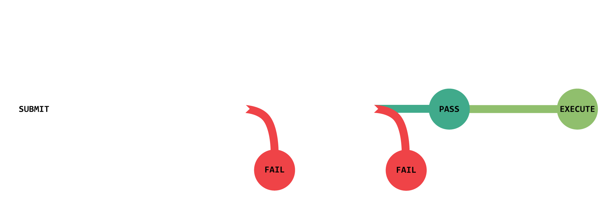
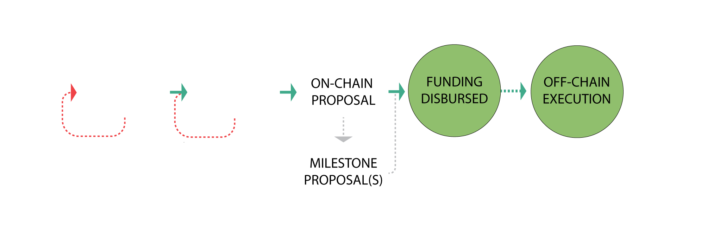
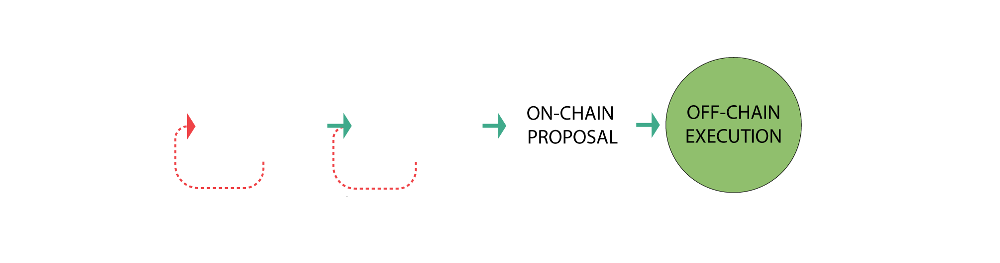

# Citadel DAO

We are a fully member owned and controlled on-chain DAO [(Decentralized Autonomous Organization)](https://ethereum.org/en/dao/) from day one. Our governance token are ship NFTs, and holders are able to vote on the use of 70% of mint funds, 50% of OpenSea royalties, and all $ORE taxes collected. Proposals are submitted and voted on by members, and can arbitrarily execute code including modifying or building on the game and governance contracts.

This represents the technical implementation of Citadel DAO's initial governance system, and launching with this foundation in place accomplishes three very important things:

1. Empowers the community to have a meaningful voice in the project, and even take it over if desired. 
2. Protects the majority of the community's investment by securing 70% of mint funds in a community treasury that they have total control over. 
3. Provides a robust economic flywheel and backing to assets in the ecosystem. 

Our DAO is completely on-chain, generously funded, and fully community empowered. It is the concrete and rebar on top of which any manner of skyscraper may be erected. Although this is a strong starting foundation, what ultimately makes a DAO a *DAO* is the people who show up to use these tools and how they wield them. 

A fully realized DAO is a verb: a thing members of a community *do* together. It is as much a culture as it is a codebase.  The tools can't build a fully functional community-led decentralized organization on their own -- that's up to each and every one of us: our vision, our collaboration, our ideas, our decisions, our passion and dedication. 

With that said, we are launching with a number of centralized levers of control via the Core Team in an effort to strike a balance between defining an initial set of governing constraints, allowing enough freedom for organic evolution of the organization to emerge from the community, and having backup strategies in case of emergencies. The goal is [progressive decentralization](https://a16z.com/2020/01/09/progressive-decentralization-crypto-product-management/) over time, and we aim to take it as far as possible. Where that ends up taking us we all have to find out together. 

With this document, our aim is to hammer down a sensible set of starting guidelines, processes, and best practices ahead of us all collectively stepping into the dawn light of uncharted territory we find ourselves in. 

Next, we'll outline how this process will work in practice. 

## Eligibility

In order to participate in governance you must have at least one $BADGE token in your wallet. $BADGE tokens are created by staking a ship into the game and are burned by unstaking a ship from the game. You may delegate the voting power of a $BADGE token to another pilot, and may also reclaim delegated voting power at any time.   

## Voting

The Citadel will be controlled through a fully on-chain governance system, built over OpenZeppelin's Governor, Timelock, and ERC20Votes. [Tally](tally.xyz) provides the front-end user interface and makes participating in governance simple and intuitive. 

### [How to view active and recent proposals](https://docs.tally.xyz/user-guides/navigating-the-app/governance-page) 
### [How to vote on an active proposal](https://articles-orzd3tqhl-thecitadelgame.vercel.app/docs/how-the-dao-works#voting)
### [How to delegate voting power](https://articles-orzd3tqhl-thecitadelgame.vercel.app/docs/delegating-votes)

## Proposals

Anyone with 5 ships worth of voting power (via ship ownership or delegation) can submit a proposal. 

Once submitted, proposals become active and enter a 6-7 day voting period. In order to pass, a proposal must reach quorum with a majority (51%+) of votes in favor. To reach quorum, at least 4% of total voting power must vote on the proposal. After a proposal passes there is a two day delay before the execution of any code that was contained in the proposal. This two day "timelock" period allows those who may disagree with the proposal to exit the project before the changes take effect. 

### [How to submit a proposal on Tally](https://docs.tally.xyz/user-guides/create-a-proposal)

### Proposal Requirements  
- Must have at least 5 ships worth of voting power. This can be a combination of ships staked directly and votes delegated by other pilots. This is code-bound rule.
- Must conform to the proposal template guidelines.
- Must be realistic, narrowly scoped, detailed, and reasonably budgeted based on fair market rates.
- All contract upgrades must pass a Solidity Finance code audit. 
- All game contract upgrades that have economic or balance implications must pass a Machinations audit. 

### Inappropriate Proposals
- **Polling opinion**: this is better done off-chain to prevent real proposals from getting overlooked. Pitching ideas for feedback should happen off-chain. 
 
- **Small matters**: customer service requests, personal disputes, small compensation requests, Discord role changes, etc. Seek out the appropriate staff members for these types of issues. 
 
- **Trolling**: there's a time and a place, and on-chain governance ain't it. 

### Appropriate Use Cases for Proposals
The primary use case for proposals is to make a significant DAO-wide decision, usually about how to allocate treasury funds. Proposals are not for day-to-day decision-making or minor tasks. The idea is that proposals can greenlight and fund the creation of anything the DAO may need or want to accomplish, including operational concerns like working groups, dedicated roles, multi-sigs, and leadership positions that are given domain-specific privileges and the authority to efficiently make more granular decisions on the DAO's behalf. 

### Proposal Categories: 
1. **Funding** 
	- Internal projects (one-time funding)
	- Grants for outside contributors (one-time funding)
	- Create, remove, or modify an operational group or role (on-going funding)
	- Default category for anything that doesn't fall into other categories

2. **Resolution** 
	- For administrative community or governance matters
	- Can officiate decisions that need to be ratified off-chain (e.g. this document)
	- Typically no funding requested
	- Role changes, clerical concerns, rule changes, discord server changes, new regulations, new processes, etc
	
3. **Contract Upgrade** 
	- Add or modify governance code
	- Add or modify game code
	- Will normally be the final milestone of previous milestone proposals

### Proposal Naming
There isn't any special title or name field for proposals at this time, but most DAOs find it useful to conform to a numbered naming standard. We'll include a naming standard on the Discourse forum and in the description field of each proposal. 

We will use CDP (Citadel DAO Proposal), where the first proposal will be CDP 1, and so forth. 

### The Proposal Process

#### **Step 0: Vet Idea on Discourse Forum**

While we are still finding our footing, all proposals must first be vetted off-chain on the community Discourse forum. This is an approach many DAOs take and we will follow their example for now. Proposals that don't go through this process are subject to being vetoed. 

1. **Pitch Idea**: Submit a post on the Discourse forum using the Pitch template and collect votes and feedback for a minimum of 3 days. If it receives majority positive votes then proceed to creating a draft proposal, otherwise rework idea based on community feedback or put it on ice.

2. **Off-Chain Draft**: Submit a post on the Discourse forum using the Proposal template and collect feedback for a minimum of 3 days. If it receives majority positive votes and doesn't need any further modification then proceed to an on-chain proposal, otherwise rework and resubmit another draft based on community feedback. 

#### **For a Funding Proposal** 

1. **Submit funding proposal**. Funds will be disbursed if passed. 

2. **Submit follow-on funding proposal(s) (if necessary)** If the requested amount is large, it's best to break up work into multiple milestone based proposals that show incremental work and request follow-on funding. This is also appropriate in continuing funding for operations related expenses. 

#### **For a community resolution** 

- **Submit a resolution proposal**. In most cases no funding is requested and no code is executed. It's up to the appropriate appointed members of the Core Team or DAO to ratify the content of the proposal if there is no code to execute. 

#### **For a Contract Upgrade** 

1. **Submit initial funding proposal** pitching the changes or features to be developed. Even if self funding, this initial proposal is standard practice to get community buy-in before proceeding to requesting an audit. 

2. **Submit funding proposal for audit(s)** that includes audit cost quotes.  The proposal will disburse funds directly to audit partner(s) if passed. 
 
3. **Submit a contract upgrade proposal** to execute the upgrade code that has passed the audit(s) and request final compensation if necessary. This proposal will upgrade the relevant contracts and disburse any requested funds if passed.

### Budgeting and Compensation
- Compensation for contributions can be requested in ETH, $ORE, or a combination thereof depending on the nature of the work being done. 
- A minimum ratio of ships to reserve funds in the treasury should be maintained as we go forward for the health of ecosystem. 
- Budgeting will be an on-going conversation and will require further discussion about apportioning funds for proposals and compensating contributions. 
- The takeaway is that we want to be fairly conservative with the use of treasury funds out of the gate.   

### Proposal Pitch Template
- **Synopsis**: 1 sentence description.
- **Category**: Funding, Resolution, Contract Upgrade
- **Description**: Describe the main idea. 
- **Rationale**: Supporting arguments.
- **Who**: is involved. 

### Proposal Template
- **Synopsis**: 1 sentence description.
- **Link to Pitch or Draft**: if a Draft Proposal, include link to successful proposal pitch on Discourse. If an on-chain proposal, link to successful Draft Proposal. 
- **Category**: Funding, Resolution, Contract Upgrade
- **Summary**: 2-3 sentences.
- **Rationale**: main supporting arguments.
- **Description**: 
	- **What**: detailed description, include any relevant supporting data
	- **Who**: is involved, what are their credentials and standing in the community
	- **When**: time scales and due dates (if applicable)
	- **How**: implementation pathways, what needs to happen to fully implement proposal and what permissions are involved
- **For and Against Arguments**: highlight why we would want to pass the proposal and why we might not
- **Criteria**: what metrics, KPIs, or deliverables represent successful completion of work or goals?
- **Milestones**: if project has a large scope, it's best to break it into separate milestone proposals. They should all be outlined here, as well as any work that has been done if this is a subsequent milestone proposal. 
- **Cost breakdown**: detailed breakdown of how funds will be used.
- **Total projected cost**: total estimated cost of the scope of the proposal. 
- **Funds requested now**: funds that will be automatically disbursed if proposal passes. 

### Example Pitch
- Create "The Station" working group

### Examples of Proposals
- Ratify community vision statement, values, and manifesto
- Divide treasury into operations fund and sovereign wealth fund
- Create "The Station" working group 

### Examples of Good Proposals in Other Projects
- https://governance.decentraland.org/proposal/?id=5193f850-5c00-11ec-9c52-0d9746a59174
- https://gov.vitadao.com/t/vdp-1-vitadao-governance-framework/40
- https://forum.barnbridge.com/t/bond-usd-smart-alpha-pool-olympus-pro/689

