# Organizing The Citadel

The launch of The Citadel will represent a fairly radical experiment in decentralizing a blockchain gaming project. This is accomplished via Citadel DAO, to which the majority of both funding and ownership are handed trustlessly via smart contracts on launch day. 

Once this happens, the founding team will become community members alongside everyone else with the exception of a set of well defined and [programmatically revokable privileges](https://articles.citadel.game/yellowpaper#governance) appropriate for overseeing the early phases of the game and project. There are many opportunities and challenges that await us on this journey, and it will be up to all of us in the community to decide how we are to meet them. 

## DAO 1.0

At the center of this community-driven venture is the DAO and the infrastructure necessary to sustain it. The team has invested a significant portion of overall development effort into laying the groundwork for a robust DAO and governance system in order to feel confident in handing over control to it from the outset. Transferring ownership of all game contracts to the DAO and funding its treasury with the majority of the proceeds from the mint is the crucial step that enables true decentralized self-determination by the community. 

This represents the technical implementation of The Citadel's DAO-first launch strategy, which accomplishes three important things:

1. Empowers the community to have a meaningful voice in the project they invest in from day one, and even take it over if desired. 
2. Protects the majority of the community's investment by securing 70% of mint funds in a community treasury that they have total control over. 
3. Provides a robust economic flywheel and backing to assets in the ecosystem. 

These governance mechanisms provide a sturdy technical foundation, but our vision for the DAO doesn't end here. We want to co-create an on-chain virtual world with the community. Operationally, this means moving in the direction of becoming a decentralized on-chain game development studio. 

This is an ambitious undertaking, and will depend on who shows up to help us get there. The technical foundation can't build a high functioning decentralized organization on its own; that's up to each one of us: our vision, our initiative, our leadership, our ideas, our decisions, and our dedication. 

We are launching with a number of centralized levers of control entrusted to the Core Team in an effort to strike a balance between defining an initial set of governing constraints, allowing enough freedom for organic evolution of the organization to emerge from the community, and having backup strategies in case of emergencies. 

The goal is [progressive decentralization](https://a16z.com/2020/01/09/progressive-decentralization-crypto-product-management/) over time, where we transition from the Core Team operations being augmented by the DAO to the DAO operations being augmented by the Core Team. This won't happen overnight, but it is the North Star that guides our efforts.

The team will seek to assist in this effort in every possible way, but ultimately it will take all of us to reach the full potential of decentralized co-creation and self-governance. In this paper, we will explore a vision of what that could look like. 

## The World of the Citadel

Before we dive into the particulars of the structure and design of a DAO, it might be useful to orient ourselves around the unique implications of what it is we're building and how that relates to the way we go about doing so. 

One perspective is that we're building an "on-chain game". The core characteristics of on-chain games are that they are fundamentally online, multiplayer, and *persistent* games. You can interact with other players, and the consequences of those actions *persist* indefinitely on an immutable blockchain record of the history of the game world. 

From here, our game moves beyond the DeFi roots of many on-chain games and begins to create an immersive 2D environment. In this environment, you have an avatar (a spaceship) that has *agency* in two dimensions. It can decide where it goes, when it goes there, and what it does when it gets there. These are very simple mechanics, and yet it forms the kernel for a much-expanded universe of possibilities. 

So we have the beginnings of a multiplayer, online, persistent, immersive world populated by avatars with the agency of how to move and behave. This begins to sound a lot like what would traditionally be called a *virtual world*. 

Will the launch version of The Citadel constitute a proper virtual world? One meta-analysis of the literature on the subject came up with the following definition:

>A persistent, simulated and immersive environment, facilitated by networked computers, providing multiple users with avatars and communication tools with which to act and interact in-world and in real-time.

<a href="https://www.scss.tcd.ie/publications/tech-reports/reports.13/TCD-CS-2013-10.pdf">What is a Virtual World: Definition and Classification</a>

Under this definition, The Citadel could arguably fall under the category of virtual worlds that were common in the 80s and 90s which relied heavily on text-based and 2D interfaces. At launch, perhaps we've reached a "minimum viable world" threshold, and we will undoubtedly move in the direction of ever more depth and immersive features after launch. 

## An On-chain, DAO-owned Virtual World

With The Citadel, we refer specifically to an **on-chain, DAO owned virtual world**. Let's break this down:
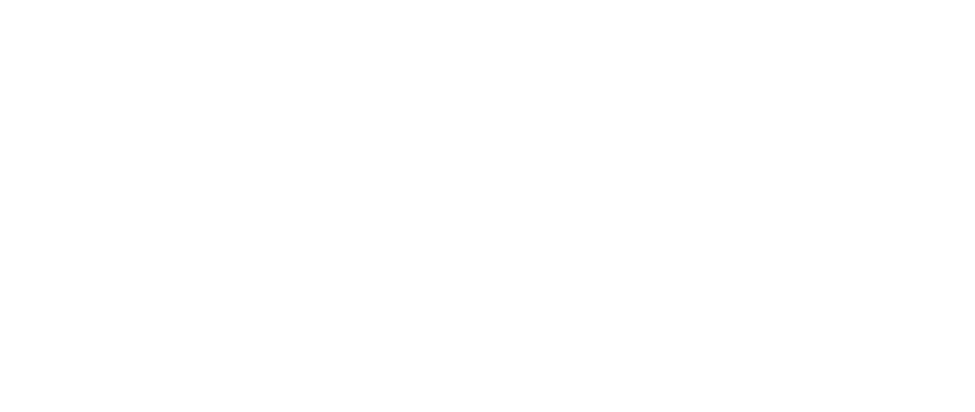
### On-chain

#### Immutable and Persistent

A major benefit of a persistent world living on the blockchain is that it benefits from the [anti-fragile persistence](/persistence/) inherent to blockchains. Of all the types of games, virtual worlds benefit from robust persistence provided by the blockchain most. Unlike many current blockchain games and metaverse projects, on-chain games host *all* of their game assets and game state on-chain. The events of the world are recorded in an immutable ledger by default. Theoretically, this allows an on-chain persistent world to live on indefinitely. 

#### The World is Virtual, the Value is Real

One of the big selling features of a blockchain game is that the pieces of the game world have real-world value and are actively traded on sanctioned marketplaces with non-trivial liquidity. A significant implication of this is that since this creates an ecosystem that is connected to real-world liquidity, *contributions to the ecosystem* can also be approximated in terms of real-world value. 

This means that it's possible to be financially rewarded for both in-game activity and contributing to the DAO in the same greater virtual world economy. In other words, in this virtual world, your actions can affect and create real-world value. 

### DAO Owned

#### Self Organizing

Decentralized and autonomous governance benefits from an agile structure that permits some level of self-organization to emerge. Even if we are to guide this process in the direction of the desired outcomes, with true decentralization and autonomy comes the surrender of ultimate control to what emerges spontaneously. 

In a self-organizing, DAO-owned virtual world we participate in a creative process that could result in a world and structure that *emerges* as much as it is designed. It is probably to our advantage to prioritize flexibility and loose coupling when it comes to designing structure and hierarchy.  

#### Co-creative

Central to the process of self-organization is the ability of all autonomous actors in the system to modify or build on the system -- to make their own independent contributions. In a virtual world, this means the players (or avatars) of the world have the ability to co-create the world they inhabit collaboratively. Ownership by a DAO is one way to enable co-creation in an on-chain world. 

### Virtual World

#### Psychologically Inhabitable

> A virtual world is an immersive virtual environment that users can psychologically inhabit. 

<a href="https://encompass.eku.edu/cgi/viewcontent.cgi?article=1018&context=ugra">Projecting the self into a virtual world</a>

One characteristic that sets a virtual world apart from many other types of products a DAO might be building is that it is *psychologically inhabitable*. That is, you can have the subjective experience of "occupying" the virtual space. This becomes especially interesting when we think of participating in a DAO as an extension of inhabiting the world in which it owns and builds. 

#### Self Perpetuating

Another characteristic that makes a virtual world a unique product is that to some extent it may come to possess an independent will to exist. Unlike most products that are designed to solve a particular problem, a virtual world can potentially cross the threshold of an "interactive entertainment" product and begin to adopt a self-perpetuating drive to simply *be* as an expression of the collective will of its autonomous constituents. 

As in a guild, members of the organization may feel they belong to something fun and special they would like to see go on. Like a nation-state, denizens of the world may feel invested in the well-being of their space and their community. This existential motive competes to some extent with the profit motive that most organizations operate around. This might change the fundamental assumptions we make about what users care about in our project. 

#### Intrinsically Gamified

In a way, applying gamification strategies to non-games requires inventing a pseudo virtual world context in which virtual rewards matter. Why does the user care they are rewarded with achievement titles, badges, points, or other virtual accolades? Beyond superficial dopamine manipulation, virtual rewards and accomplishments only *matter* in relation to the context in which they exist. From the user's perspective, the more meaningful the context the better. 

Ideally, your rewards are part of a greater system that other people participate in and who can see and recognize your rewards as valuable. When the product a DAO owns and builds *is* a virtual world, there is no need to invent an artificial virtual context for rewards to matter in; gamification is native to the platform. 

## Decentralized Autonomous World

The Citadel is at the intersection of all the above characteristics, which places us into somewhat uncharted territory. 

The truly unique a of an on-chain DAO owning an on-chain virtual world is that one can become an inextricable part of the other. Rather than an on-chain game that just so happens to be owned by a DAO, we could instead recognize this to be a singular on-chain world that is owned and operated by its players. It accomplishes this via governance mechanics that could be considered as native to the world as any other on-chain mechanic. 

For example, we'll talk later about a proposed "working group" called the Council, a type of oversight committee for the DAO. Fleet Commander has been "reporting to the Council" from the start of the project from a lore perspective. "The Council" could theoretically exist in-game in some form or another. Voting on proposals occurs in the "Parliament" in the lore, which could also theoretically actually exist in-game -- certainly via an in-game interface. The DAO has the capacity to increasingly move from an external abstraction toward an entity that inhabits the world. 

The point here is that all the qualities that apply to the virtual world can also apply to the DAO, since they can be viewed as one and the same. The DAO aspect of this world has the unique potential to be fun, immersive, and natively gamified. The "organization" in our "decentralized autonomous organization" could increasingly inhabit and operate in the world it owns and builds and becomes a kind of a decentralized autonomous *world*. 

The potential of such a world is a virtual space where participants can create, play, socialize, learn, and teach. They can collaborate on building the virtual realm they themselves would most like to inhabit. Their contributions, both large and small, can be rewarded in ways that are meaningful both to the virtual world itself and to the real world. Players will not be asked to "play to earn" via joyless mechanics; they will be invited to *inhabit the world* they own and be rewarded for the value they contribute along the way. 

This idea of decentralized autonomous worlds may sound very well in theory, but now we must begin to imagine how this might all work in practice. With the help of thoughtful gamification strategies, a robust economic engine powered by the game loop, delegating domain-specific authority to trusted community members, community collaboration tooling, and prioritizing the on-boarding of new participants via gamified learning, we might begin to see that a decentralized virtual world actually holds tremendous potential as a high functioning organization. 

## Navigating Uncharted Territory

Standing up a new DAO that is meant to eventually become something akin to a decentralized game studio is a challenge fraught with complexity and uncertainty. We're way out on the fringes of the frontier, and there are no maps for where we're headed. When the path is uncharted, the best we can do is find the North Star of our mission, and let our compass point the way. 

Our compass cannot define an exact path, but it will let us know when we've drifted off course as we face unknown obstacles and allow us to course correct. We'll take the journey one step at a time, responding to what emerges with the tools and skills we take with us in new and evolving ways. 

Among the best tools at our disposal is experimentation. When faced with uncertainty, we can design low-stakes experiments where failure is part of the process and iterated upon rapidly. Rather than getting bogged down by the need for certainty before taking new steps, we can feel confident moving forward knowing that whether we're on the trail or not is less important than staying in motion and adjusting along the way. 

## Trade-offs in Decentralized Design

In attempting to shift from a negative-sum to a positive-sum mindset, it is helpful to become aware of the existence of conflicting polarities. There is a temptation to favor one dualistic extreme over its opposite, but if we instead view them as two complementary forces to be held in balance we don't have to chose sides. 

### Centralization vs. Decentralization 

Decentralization in particular is often raised up as manifestly righteous in all scenarios in web3 culture. Centralization becomes the nemesis, a force to be rallied against and eventually defeated for good if we are to make real progress.

When referring to a decentralized game, project, or organization, what's important is the specific parts that benefit from decentralization. To insist that absolutely everything is decentralized and that centralization in any form is taboo is a seductive but ultimately limiting approach.

In a holistic model of systems, decentralization and centralization are both equally vital forces we can harness for maximizing positive-sum outcomes. The trick is in knowing how best to utilize each polarity at different scales and in different contexts. 

Whereas the models that came from web2 and before tended to overly apply centralized mechanisms, web3 may tend to overly prescribe decentralized ones. Over the last few years of rapid experimentation in the nascent DAO space, some have found that the fully decentralized decision-making model is not viable or even desirable at scale.  

In reality, any particular DAO operates on a [spectrum of decentralization](https://mirror.xyz/beeradley.eth/7nm4-soijTclpV2r-B1zxHEjUnMAJehRfM-BxdnS2A4). 

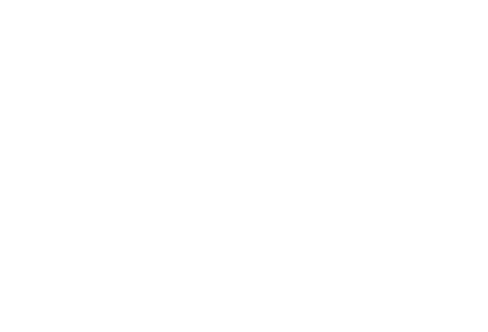

The above chart attempts to map out what scales and contexts the spectrum of decentralization might intersect in our DAO. We see decentralization show up in the foundation: stake in the organization. All members own a piece of the pie, share in the upside or downside effects, and can express a meaningful voice in the goings-on of long-term spending and operations. The buck starts and ends with the sovereign will of the token holder.

Where we see centralization concentrate is in the medium to short term on-going problem solving and decision making of groups and key individuals. Although these executive entities have been empowered by the stakeholders to act on their behalf, they are accountable to the stakeholders at all times and every level of all hierarchies. Executive agents can be directly or indirectly disempowered by the token holders; the reverse is not true. 

#### Hierarchy

Hierarchy is a valuable, time-tested tool that is uniquely capable of solving problems where the solution is known and straightforward. Outcomes are predictable and everyone knows what is expected of them. Planning is possible and effective. 

The drawback of hierarchies is they are not well equipped to respond to emergent, complex environments where the solution is not clear and the parameters are constantly in flux. The top-down decision-making model that excels in executing well-drawn plans becomes a bottleneck when there's too much going on at the edges to centrally track and respond to.   

#### Heterarchy

The ideal approach may look like incorporating multiple fluid hierarchies, a concept sometimes referred to as heterarchy. 

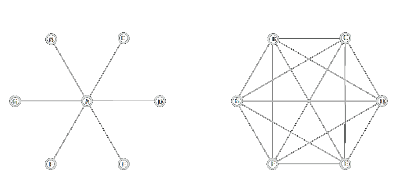

In this approach, hierarchies intersect one another and are domain and context-specific. Authority and leadership naturally flow from knowledge and expertise in a particular area and don't necessarily translate to other domains. This is natural to the way most people behave in group settings: we tend to defer to those who have the most expertise or influence in a particular area. 

### Building Trust vs. Taking Action

> "Go slow now to go fast later" 

-- Unknown

While there may be a temptation to try to onboard as many contributors as we can and grow as fast as possible, there's a case to be made for deliberately starting small and growing slowly in terms of core contributors. 

Organization and incentive design can take us a long way, but ultimately the work comes down to the relationships between people. In decentralized networks, the strength and quality of relationships are more important than the number of connections. Tight-knit teams that come to know and trust each other are going to be best positioned to navigate the unique challenges of a decentralized organization, and this can't be rushed or forced. 

### Divergence vs. Convergence

<a href="https://twitter.com/beh_zod/status/1518642746155692032">Behzod Sirjani @beh_zod</a>

Decentralized autonomy means the freedom for any single part of the whole to move and experiment in new directions without necessarily asking for permission. This creates space for the spontaneous emergence of new ideas and solutions that *diverge* from the status quo. These divergent forces are what allow decentralized organizations to be adaptable, creative, and responsive to complex environments. 

Space should also be made for the divergence of disagreements, the expression of multiple perspectives, and asserting independence. When divergences in opinion and perspective are conducted in safety and in good faith, they can lead to a higher quality of ideas and decision-making.   

The risk of all these divergences is that the edges of the organization can start to move away from its core purpose and becomes less focused and efficient, fracturing energy and efforts. Communication can become more siloed, and critical exchange of data and context is hampered. 

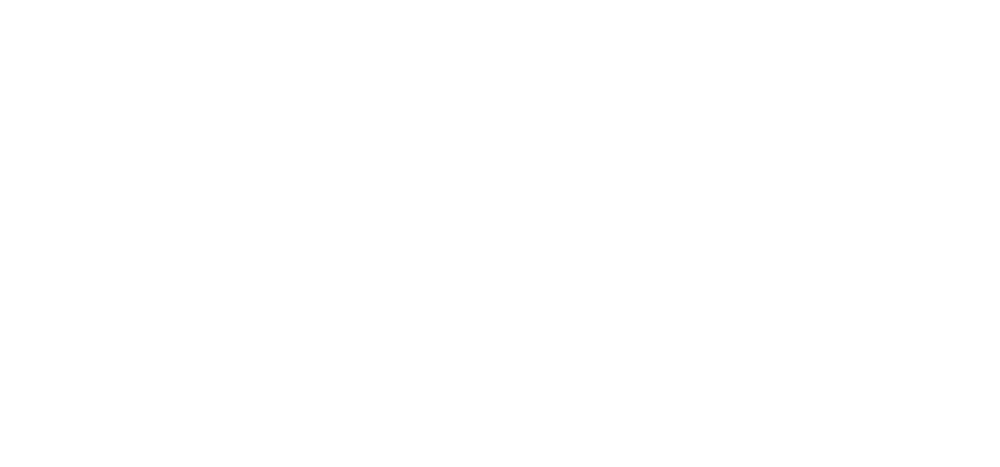

The goal is to establish enough room for the emergence of divergent creativity to flourish while also eventually integrating these new strands back into the core of the organization. From the creative chaos of divergence, the process of convergence is one of bringing the best ideas together, identifying overlapping themes, and then consciously integrating and making decisions. 

Convergent attractors can be used to counterbalance the emergent tendency toward divergence and can take many forms, including: 
- A council of elected leaders who provide administrative oversight, guidance, and fallback decision-making for other groups. 
- Promoting an ethos of proactive communication, asking leaders of groups to share the lessons they have learned and maintain an open feedback loop. 
- Catalyze social and cultural community building that strengthens relationships and communication across the DAO. 
- Gamification and economic incentives that reinforce the organization's greater mission and values. 

### Planning vs. Emergence

Two conflicting polarities the Core Team has had to reconcile in designing the decentralized aspects of The Citadel are the need for top-down planning vs. letting things emerge from the community organically. We will all be facing this challenge as we collectively stand up the early phases of the DAO together, and it's a trade-off we will make time and again. 

> "Navigating these two polarities results in what we call planning for emergence—sensing into the past, present, and future to identify and pursue high-potential opportunities while maintaining a spirit of experimentation in order to adapt quickly to new information."

-- *Impact Networks* by David Ehrlichman 

While it can be uncomfortable and scary at times, building a community-governed organization involves an element of surrendering to the unknown. Planning is essential and tremendously valuable, but overly rigid prescriptions can constrain the ability to adapt and integrate the collective voice. Too much planning too far in advance can stifle creativity, sap energy, and waste potential. 

The design of organizing structure involves a similar balancing act. If too much structure is imposed, there is little room for collective discovery, spontaneous collaboration, and unforeseen innovation (not enough divergence). Without enough structure, efforts are too easily fractured and unfocused (not enough convergence). 

## Structuring the DAO
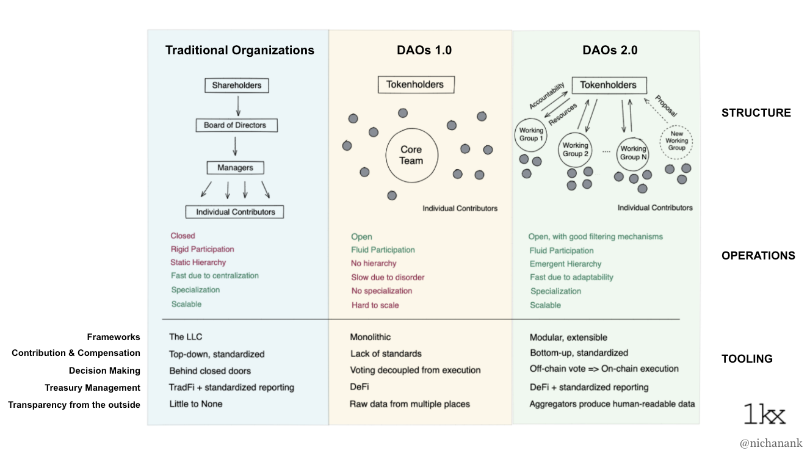

1kxnetwork's excellent <a style="" href="https://medium.com/1kxnetwork/organization-legos-the-state-of-dao-tooling-866b6879e93e">Organization Legos: The State of DAO Tooling</a>

When we look at what the above chart refers to as a DAO 1.0 versus a DAO 2.0, the launch version of Citadel DAO will land closer to the 1.0 model. The majority of day-to-day project management will still be concentrated with the core team and early community decision-making will necessitate a DAO-wide democratic vote on a proposal. So there will be DAO 1.0 way of getting things done initially, and the team will provide as much documentation about how to go about this as possible. 

Meanwhile, the goal should be to steadily move toward a 2.0 model with better-defined areas of responsibility and more delegation of domain-specific authority to trusted community representatives. 

## Working Groups

Proposal based governance can be used to empower trusted teams of contributors to make day-to-day decisions on the DAO's behalf. These operational teams are usually called working groups, pods, or guilds depending on the DAO. The purpose of working groups is to formalize subject domains that are important to the project into functional units that are assigned limited operational responsibility for that domain.  

Using an approach like yearn.fi's [constrained delegation](https://gov.yearn.finance/t/yip-61-governance-2-0/10460), limited executive decision-making power can be conditionally granted to individuals that the community trusts to represent them and their best interests. 

This approach solves a big problem with self-governance in that a pure direct democracy decision-making model doesn't scale very well. With working groups and constrained delegation, we can empower trustworthy and capable community members to act independently on the DAO's behalf. Those that have the most context for making good decisions are trusted to use their judgement, but are still accountable to the voting body of the DAO.  

### Roles

Proposal governance can also be used to define specific roles across the DAO and in each working group that are granted specific privileges appropriate for carrying out the objectives of each role. We can then approve transparent funding for the execution of the role mandate, and hold those using the funds accountable.

### The Chicken or Egg of Working Group Formation

In launching a new DAO we are faced with the tension between predefining structure and allowing for what emerges organically. Do top-down, centrally planned working groups form a new DAO, or does a new DAO form bottom-up decentralized working groups? 

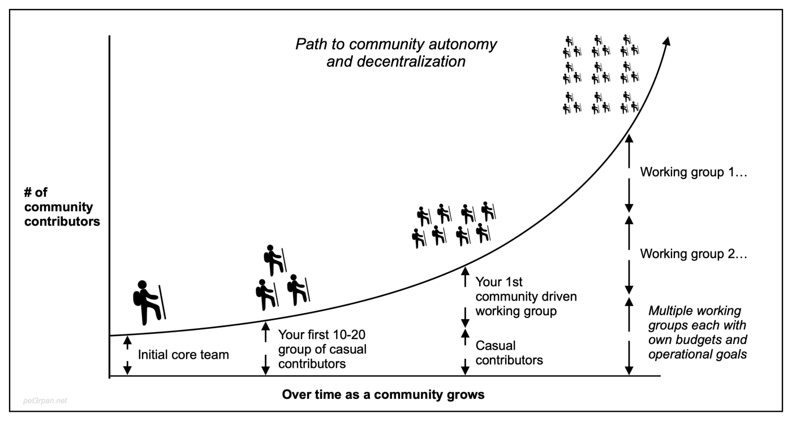

<a href="https://medium.com/1kxnetwork/how-communities-gain-operational-autonomy-over-time-e5518d262f86">How communities gain operational autonomy</a>

There are different strategies for the incorporation of operating roles and groups in a new DAO. 

Some projects attempt a top-down approach, where the founding team designs a fully developed structure with well-defined areas of responsibility from the outset and then attempts to recruit community support in performing those roles. This provides more clarity about process and may achieve a functioning model more easily, but lacks flexibility and may struggle with community buy-in and operational coherence (theory colliding with practice). 

The more common and essentially default design is to deliberately embrace tabula rasa and allow structure and groups to emerge organically over time. This is the most decentralized approach where you get community buy-in by default, but may result in a more chaotic and dysfunctional situation in the early phases, with an increased risk of disengagement or burnout. 

The approach the Core Team has taken in standing up the Citadel DAO is to lean towards the open-ended approach while providing strong guidance, oversight, and leadership by example. We are opinionated and have a vision for what the DAO could be that we outline in documents such as this, but prescribe only a minimal structure for how to go about realizing it and wish for our vision to merge with one shared by the collective. 

We will encourage, support, and hopefully inspire community support in co-piloting the DAO toward this vision, and have in the interim reserved the right to exercise some level of centralized course correction when we feel it's in everyone's best interest. Ultimately, we seek to work toward a level of decentralization where such interventions are either not necessary or replaced by a decentralized equivalent. 

Because critical operational concerns will be managed under the Core Team initially, we feel there is enough of a safety net to empower the DAO to be bold and play with low stakes, safe-to-fail experiments in discovering the best and most natural path forward. 

### The Lifecycle of a Working Group

One way to think of this approach to emergent organization design is in terms of the lifecycle of a living organism that progresses through several distinct phases. 

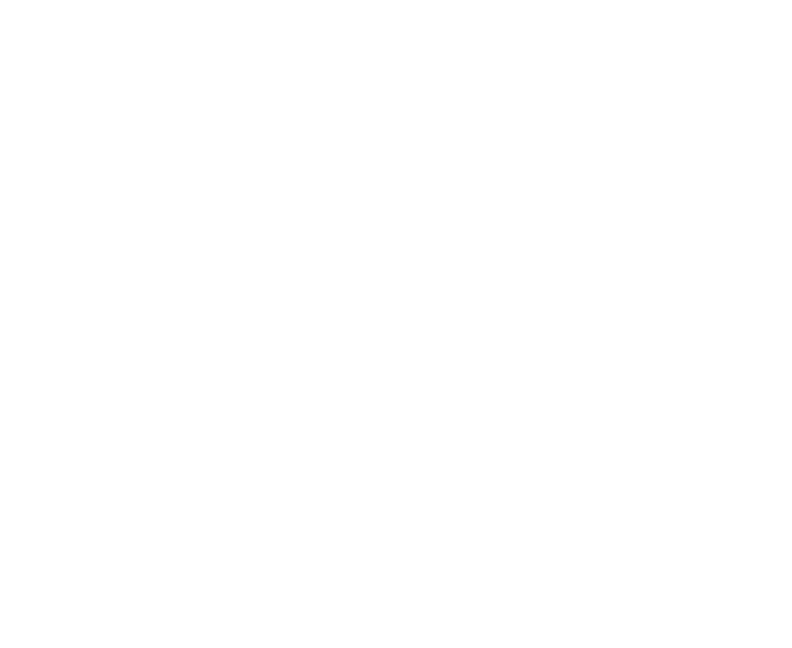

#### Phase 1: **Primordial Soup** 
Instead of dictating structure, the Core Team focuses on supporting positive emergent behaviors and disrupting negative ones. 
- Identify individuals and groups taking the initiative to collaborate on contributions and offer them support and guidance.
- Identify opportunities for contribution, surface them for the pool of potential contributors, and offer support and guidance to those who volunteer to help out.

#### Phase 2: **Recognition, Formalization, Tools**
Once a group has already been working together in some capacity, encourage and support them in submitting a proposal to formalize themselves as a working group with a clear mandate. Showing examples of what they have already been working on is a great way to gain support for the proposal. 

The main ask from the proposal will be the community's support in carrying out their mandate in the form of privileges and collaboration tools: discord roles, discord channel, Discourse roles, Discourse board, setting up new low-cost or free tools, and any other community tooling or privileges necessary to support their mandate. 

#### Phase 3: **Funding, Defined Roles, Autonomy**
Requesting funding should ideally come after a group has a track record of success as a casual formal working group and lack of funding begins to present clear barriers to progress. 

Sensible things to request funding for via proposals:
1.  **Dedicated roles**: creation of a paid full or part-time recurring role, such as a group leader or essential dedicated role that demands sufficient time and attention that the DAO would want to adequately fund its continuation and expansion.
2.  **Quests or Bounties**: a way to post one-off or recurring tasks with well-defined completion criteria and a predefined reward that anyone with sufficient standing in the group can voluntarily tackle.
3.  **Third-party services and tools**: the first example of this will likely be paying for Solidity Finance and Machinations audits for any contract upgrade work that the community takes on, but there are many other potential examples.

There are types of contributions people will want to make voluntarily that the DAO may be unable or unwilling to fund, but these efforts can still be recognized via achievements, special roles, and greater trust and responsibility in the DAO (see: Universal Achievement System), which could ultimately lead to opportunities for paid compensation. 

At some point, it may become appropriate to begin using various payroll and fund management tools to coordinate fund allocation and compensation within the working group. Examples might include:
    
- [Gnosis Safe](https://gnosis-safe.io/) for a working group multi-sig operating fund
- [Coordinape](https://coordinape.com/) for peer feedback based compensation / bonuses
- [Paymagic](https://www.paymagic.xyz/) or [Parcel](https://parcel.money/) for bounty/quest and recurring payroll transfers

#### Phase 4: **Maturity and Self Sufficiency**
	
Over time, working groups will likely gain more autonomy, operational coherence, and trust both interpersonally within the group and a positive reputation to the greater DAO. In effect, they could become more of a semi-autonomous sub-DAO over time.
 
#### Phase 5: **Split, Merge, Contract, Expand, Dissolve**

Of course, not all working groups need be permanent. If the mandate of the group is no longer relevant to the current operational needs and priorities of the DAO it can contract, merge with other groups, or spin down entirely. A proposal for requesting renewal of funding is a good opportunity to assess the current trajectory of the group and adjust accordingly.
    
**Squads**

If the mandate of a single working group expands to a large enough threshold it may find it needs to split up into smaller, more manageable units. At some point, it may make sense for projects that the group is working on to split off into project teams we might call "squads" that spin up and down as needed. For squads that discover a recurring role to play or perhaps a larger scope of work to tackle, it may even make sense for them to break out into their own full working group at some point.

### A Network of Teams

A more mature version of the DAO might begin to resemble a network of semi-autonomous squads, working groups, and sub-DAOs more than a typical top-down org chart.

Achieving a high level of operational proficiency is particularly important for our DAO given our aspirations of becoming a kind of decentralized game studio. This puts us in the category of a *product* DAO and most existing examples of product DAOs are found in the DeFi space for protocols like Yearn and Index Coop. These DAOs were some of the first to experiment with working groups, and have since run into [limitations](https://gov.indexcoop.com/t/index-2-0-leadership-governance-and-decision-making-pods-nest-and-wise-owls/3214) with their first attempts at working groups. 

Index Coop is a DeFi protocol DAO that recently overhauled its working group structure into a system of what they call "nests" and "pods". [Pods](https://www.orcaprotocol.org/)  represent semi-autonomous working groups that are clustered into related categories of subject domains called nests. The idea is that groups working on similar goals and KPIs can share administrative and coordination overhead in the same nest. 

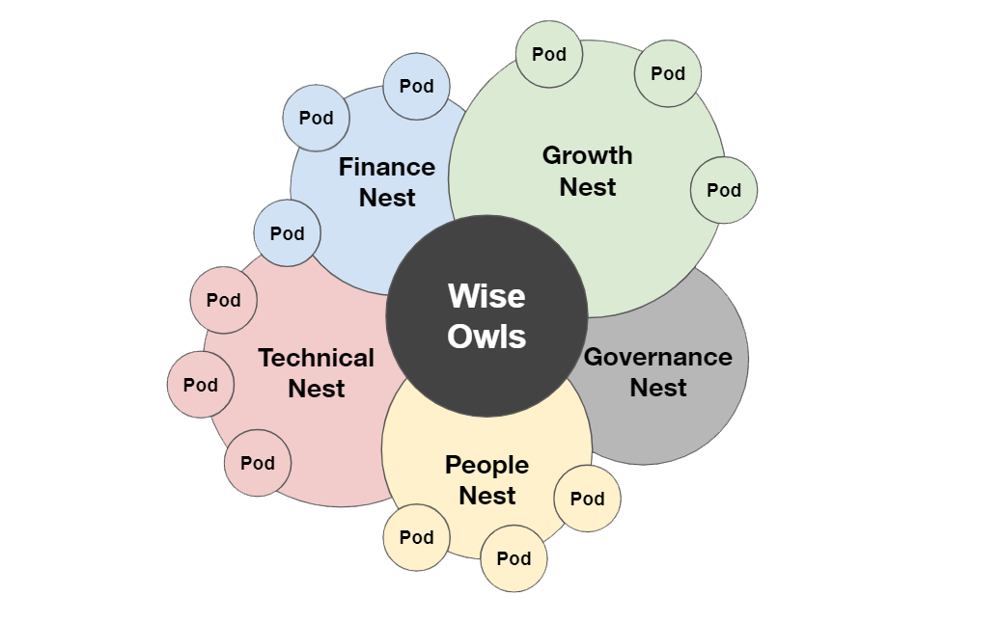

<a style="" href="https://gov.indexcoop.com/t/index-2-0-leadership-governance-and-decision-making-pods-nest-and-wise-owls/3214"> Index 2.0: Leadership, Governance and Decision Making (Pods, Nest and Wise Owls)</a>

While the zoomed-out view of the overall structure somewhat resembles a loosely coupled hub-and-spoke hierarchical model, when we zoom in we see an interconnected web of lateral relationships that looks more like a network of teams. Further, their Wise Owls leadership council is less a central command center and more of a cross-functional decision making group that identifies areas where existing groups are stuck and proposes solutions. 

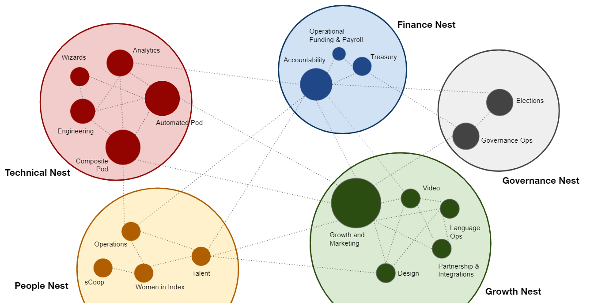

### Working Groups for Citadel DAO

As we've discussed, the Core Team has chosen to not predefine a working group structure and instead let community members propose their own groups based on who shows up and what they decide to start collaborating on in service of the purpose and principles the DAO stands for. 

In effect, the Core Team will be the first official working group and will attempt to lead by example. We do have some ideas for other groups that would likely make sense at some point.  
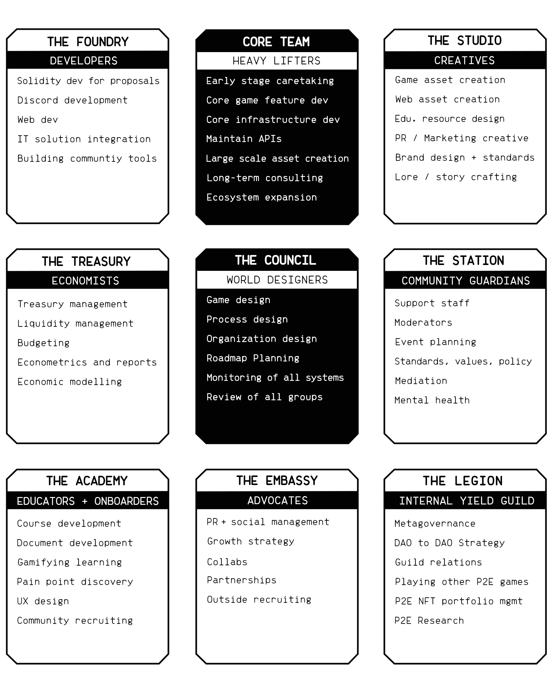

#### Core Team

The bulk of the areas of responsibility mentioned above will initially live under the core team's umbrella. The goal is to hand many of these responsibilities over to community working groups over time. The Core Team will likely oversee many of the critical architecture and services for the long term, but could theoretically one day even hand off those responsibilities to a high functioning technical community working group. 

Since the Core Team is essentially just a working group with a limited set of revocable privileges it can be fired or restricted by the DAO if this was ever deemed necessary.  

#### The Council

There are several ways we could approach a community leadership council: 
1. A leadership council similar to Index Coop's Wise Owls, where we elect independent leadership positions for The Council in addition to the other working group leaders. 
2. A kind of internal U.N. where group leaders of all other working groups coordinate with one another and make sure efforts are aligned across the organization. 
3. A mixture of one and two combined into a joint steering committee. 

Regardless of the specific approach, forming some type of leadership council is likely going to make sense once we have more than a handful of groups established. There's no doubt a threshold of operational complexity we'll encounter where better central coordination is warranted. Such a leadership council could assist the DAO out in several important ways:

- Collect and disseminate context from all other groups
- Provide guidance and feedback
- Long term planning and strategy
- Track emergent divergence and find ways to integrate it back into the long-term mission
- A decision-making clearinghouse, where edge case and higher-order decisions that individual groups get stuck on can be resolved
- Facilitate meetings with all major groups to:
	- Collect and share the most up to date context
	- Increase consensus on core issues and decisions across the DAO

Initially, the Core Team will be playing this role by default, but we would like to see community leaders empowered to take over much of this responsibility over time. The Council could be given special powers in case of emergencies, such as one day taking over the proposal veto power from the Core Team. 

#### The Foundry

Community engineers. Will work closely with and be supported by the core team as well as the resources the Core Team develops. An important role for this group could be to help the community develop and execute proposals, which would represent a huge step towards self-sufficiency. 

#### The Studio

Artists, writers, videographers -- anyone with creative skills to offer. Much of how the world will be built out could be dreamed up here. 

#### The Treasury

Economic oversight and reporting, treasury management, budgeting. This will be an area of critical importance for the DAO. Treasury management is a huge topic involving portfolio strategy, risk management, and budget forecasting. 

Some DAOs empower their treasury groups to set budgets and approve various funding requests, while others reserve this power for leadership councils or proposal voting. 

#### The Academy

This could be an interesting mix of both educators and UX optimizers. The Academy's primary mandate could be to onboard new players, welcome and integrate them into the community, and walk them through their contributor's journey as efficiently as possible, which will involve a mix of strategies and skills.

#### The Station

This is probably one of the first examples of a working group most people would imagine existing since we already have a version of this in the Discord, and it's likely the first one that will get funded. The community team we already have would likely transition into this working group where they would have more direct oversight by the DAO. 

We could expand on this to include extra efforts to look after the well-being of community members and team members of working groups, including mental health initiatives, conflict resolution (mediation), and maintaining community standards. 

#### The Embassy

The Embassy would concentrate on representing The Citadel to the public and growing the player base: PR, social account management, growth strategy, collabs, and the like. It could also handle external recruiting for working group positions if that's ever needed or appropriate. 

#### The Legion 

An increasingly important topic in decentralized governance is the idea of [meta-governance](https://hackernoon.com/what-is-metagovernance). Meta-governance refers to a situation in which one DAO holds the governance tokens of other DAOs and can thus participate in their governance process. This results in a kind of soft entanglement of the cross participating DAOs.

For a blockchain gaming DAO like ours, an interesting idea is that meta-governance could mean buying NFTs of other P2E projects and having members of our DAO participate in other  P2E games. This in effect describes a type of internal yield guild.

So the idea for The Legion would be an internal yield guild that:
1. Participates in the governance of other DAOs, reflecting our values and priorities while also establishing friendly relations with like-minded projects. 
2. Potentially plays other blockchain games and earns a yield for our DAO, if that makes pragmatic and financial sense.  
3. Manages a portfolio of gaming NFTs and governance tokens. 

The technical-logistical implementation of this could be tricky, but it's another unique opportunity presented by a DAO-owned gaming project we can explore. 

## Gamification

Another idea that we can explore to incentivize participation and community contribution is in expanding the idea of the game world to include the entire organization and community at large by making participation fun and rewarding across the entire ecosystem. 

We have established that gamification is native to our platform and there are many opportunities for implementing gamified hooks throughout the ecosystem. The term itself has become a bit of a buzzword, so let us define gamification on the basis of how it can be relevant and useful for aligning the interests of autonomous participants in a decentralized organization.

First and foremost, the goal of gamification should not be to dumb anything down, cater to short attention spans, or hijack dopamine pathways for shallow purposes. The goal should be to: 

1. **Optimize** the user experience across all points of contact in the organization. Find ways to remove friction from all processes, clear away barriers and bloat, and streamline interfaces. 

2. **Incentivize** positive sum action taking amongst free actors. Identify the most important actions or contributions and explicitly recognize their value via formalized rewards. 

Incentives that convey an increased sense of ownership, social status or recognition, or other intangible rewards should be used wherever possible as these will motivate individuals who are *intrinsically* motivated (long term interest in the project) vs. financial rewards that will appeal more to those who are *extrinsically* motivated (short-term interest, self serving). 

In this way, we can define gamification as the design of positive sum feedback loops using a combination of UX design, process design, and mixed incentive structures.  The goal should be to gamify every aspect of participating in the overall ecosystem in the most holistic way possible. Gamifying governance, contribution, and learning is a powerful way to motivate a collective of autonomous agents in a decentralized organization to collaborate voluntarily and effectively. It needs to be approached thoughtfully, but if done well, it should be a good deal of fun.

## A Universal Achievement System

At the heart of the gamification strategy could be an achievement system that provides primarily non-financial recognition and rewards for positive contributions and behavior throughout the entire ecosystem. 

You, the player, are the "character" or "avatar" of this system that earns achievement badges, XP, levels, and special roles. These achievements and titles could follow you around wherever you go in the virtual world, potentially unlocking access to restricted content, privileges, and exclusive benefits. 

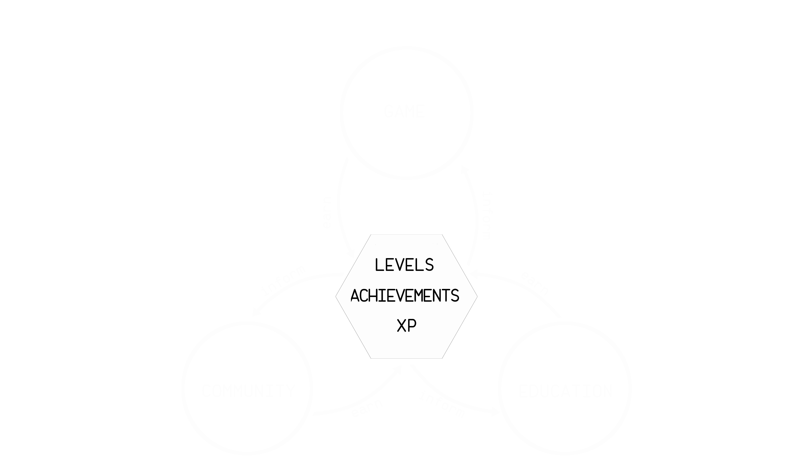

In a way, these universal achievements constitute your performance history and record as a player and community member. In other words, it could essentially act as a reputation system, an idea that many DAOs are actively contemplating and discussing this year. 

A related idea is that of ["Soul Bound Tokens"](https://vitalik.ca/general/2022/01/26/soulbound.html) recently proposed by Vitalik Buterin and [others](https://papers.ssrn.com/sol3/papers.cfm?abstract_id=4105763). The idea is that many of the most important aspects of how non-digital society functions rely on non-transferrable credentials and reputation systems. With a non-transferrable "soul bound" token, such systems could begin to be approximated in digital space. At some point this could result in a new token standard on Ethereum, which could be a great help in building our universal achievement system. 

All accomplishments would ideally be publicly visible across the primary interfaces. In Discord, this could be represented with special roles and titles. In the game interface, there could be a "trophy room" that displays all your accolades and stats, and perhaps these things could be visible to other players via an in-game profile. Or perhaps there's a dedicated "community dashboard", which we'll explore more later. 

Ideally, this system is implemented on-chain.

### World XP System

World XP (experience points) could be a type of point system that represents the path of the community member. It can be earned in any part of the world (game, DAO, community, courses) but only for actions that are considered positive for the individual's progression and ultimately the world. There might also be XP systems with more limited scope, such as a ship or pilot XP system that is specific to in-game actions. 

In the game, perhaps taking actions for the first time can be rewarded with XP to mark the progress the player has made by doing something new. However, the point of world XP is that it can't be "grinded" for by repeating the same actions over and over again. 

World XP could also be earned by completing educational courses, participating in DAO governance, contributing to or joining DAO working groups, completing DAO quests, or receiving a community award for positive interaction or contribution (Architects and Facilitators of the Station could hand these out). 

### Achievement Badges
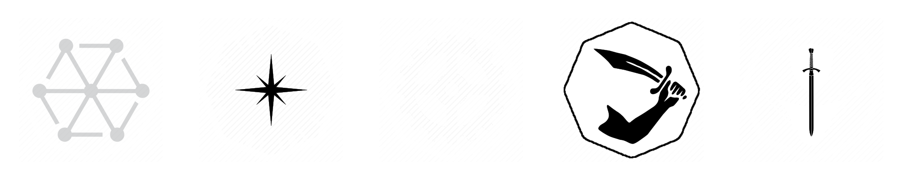

The concept of achievement badges takes inspiration from both the in-game achievements most of us are familiar with in modern games as well as <a href="https://poap.xyz/">POAPs</a> (digital mementos). The intent is both to reward valuable, positive actions and contributions as well as to commemorate important steps taken throughout the journey of a community member. They would also be great for recognizing participation in a community event or contest. Many achievements would likely also coincide with earning XP. 

Some badges could unlock special content (e.g. unique ship skins), or even be pre-requisites for gaining access to certain levels or roles. This becomes especially relevant when we discuss gamifying education later on. 

### Levels

Level|Title | | Level | Title
--|--|--|--|--
1| Visitor | | 6| Master Chief
2| Citizen | |7| Captain
3| Recruit | |8| Admiral
4| Cadet   | |9| Commodore
5| Pilot  | |10| Commander

In most RPG games with a level system, levels generally correspond with reaching a predefined amount of XP and we could borrow the same idea. This allows for quickly identifying how much each member of the community has participated and contributed to the world. 

One use case for levels could be minimum level requirements for gaining access to various community and DAO-related privileges. It could make sense for leadership roles to require minimum levels to even be eligible for consideration. 

Another possibility is where levels that generally coincide with senior or leadership roles (Level 6 and up) can't be earned automatically and require satisfying a set of pre-requisites to be considered for manual promotion by higher-ranking roles in the DAO. With this approach, we could even consider entrusting special privileges to the highest levels like limited moderation powers in Discord. 

### Seasons

The concept of seasons popular in modern games has been effectively applied to DAOs by pioneering projects like [Friends With Benefits (FWB)](https://fwb.mirror.xyz/Wy0A7swyDOwycS7q3SgDtsp7JMgoe61zJv7lTs6bcOQ) and [Forefront](https://ffdao.notion.site/Forefront-Season-2-FAQ-62903ac3ac5345e9ab22b69499f01d35). The idea is to encapsulate an ethos over a specified period of time such as one quarter or one year. Time-limited goals and KPIs related to the theme of the season can be defined upfront to inspire strategies for achieving those targets with focus and intensity. 

An interesting aspect of incorporating seasons into the rhythm of work and planning is there is the potential for an "off-season", where the DAO consciously blocks out part of the calendar to reflect on what happened over the previous season. This time can be used to review what is and isn't working, incorporate lessons learned, and process this all into takeaways that can inform the goals and targets of the next season. 

## A Loop of Loops

We've thus far established that A DAO structure based on working groups brings us much closer to a functional operating framework as an organization. A universal achievement system provides a toolkit of fun, non-financial rewards that can be used to gamify any part of the ecosystem and motivate collective autonomous action-taking. But if we are to take this idea of a truly self-sufficient, decentralized autonomous world seriously, we need to think about how it will operate as a holistic system in practice.

One way to envision a self-perpetuating, self-organizing world is as a loop of loops. In the above diagram, we can identify three separate loops that all feed into each other to form one master "game loop" of the overall system. 

1. The **economic loop** is powered by and contains the actual game loop. Value is captured from all economic activities related to the game world into the DAO treasury, which underpins the integrity of the greater ecosystem. This loop funds the development of the game, the DAO, and educational resources in addition to rewarding positive contributions.

2. The **contributor loop** guides new participants down the path toward greater engagement and contribution to the project, ultimately culminating in high-value core contributor and leadership positions in the DAO. This is where all the core building happens, including supporting and growing the economic and educational loops. 

3. The **learning loop** gamifies learning and integrates it all throughout the virtual world. Learning can be incentivized via a gamified reward system where progression through the educational material will yield rewards elsewhere in the ecosystem. The objective is to onboard more new participants and help them to become outstanding community members as quickly as possible.  

Let's discuss each piece in more detail.

## The Economic Loop

The economic engine is powered by three different kinds of "activity motors": 

1. **In-game activity**, a.k.a. the actual game loop. Examples include the in-game ship auctions, $ORE being generated and taxed, $ORE being burned, and ships getting destroyed. This activity generates value in the form of both utility and tax revenue that gets sequestered into the DAO treasury. 

2. **Market activity** at this point will mostly be limited to NFT exchanges like OpenSea, which generate royalties that are also sent directly to the DAO treasury, as well as DEX's like UniSwap for exchanging $ORE. This is where outside liquidity for in-game assets and tokens enters the system. 

3. **Community activity** represents the collective actions of all participants in the ecosystem and where the most value creation happens. Funding from in-game and market activity is invested into developing the game, DAO, educational resources, and any other community assets. 

One way our Chief Economist 0xHeimdall likes to think of the DAO treasury is as a type of economic flywheel that is able to frictionlessly capture a portion of the value spun off of the various activity motors for long term storage. This long-term store of value provides real backing to the floor price of game assets (NFTs) and bolsters the overall economic stability of the ecosystem.  

### Operating vs. Investment Funds

In the [Yellowpaper](https://articles.citadel.game/yellowpaper#dao-treasury-funds), we stress the importance of maintaining a minimum ratio of funds in the treasury to the total supply of ship NFTs in order to provide a hard backing to the ecosystem. Toward this effort, it may be useful to segregate funds between an operations fund for funding proposals and a long-term investment fund. 

The thinking is that the operations fund will determine the operating budget available for funding proposals, compensating contributors, and covering any other operational expenses over a given period. Meanwhile, the bulk of community funds would be held in a investment fund and managed for long-term growth. 

Segregating operating funds could act to protect the bulk of community funds stored in the investing fund. We could require higher quorum and majority vote thresholds for proposals that request access to funds in the investment fund vs. the operating fund. 

Contributions to the operating fund could be determined as a percentage-based portion of incoming $ORE taxes and ETH royalties. The fund itself could have a maximum balance cap at which point excess funds would spill over into the investment fund. Alternatively, the operating fund could be explicitly allocated funds via funding proposals at regular intervals.  

#### Examples of Operations Funds:
- [Index Coop - TWG - Operations Account](https://gov.indexcoop.com/t/twg-operations-account/1289)
- [Yearn - YIP 54: Formalize Operations Funding](https://yips.yearn.finance/YIPS/yip-54)

## The Contributor Loop

A major potential advantage of a decentralized autonomous world project is that it can harness and integrate the collective passion and creativity of its participants in real-time. Think of how much untapped creative and productive energy is wasted by the millions of fans of traditional franchises who are given neither permission nor outlets to co-create along with the proprietary company. Fan-art of corporate-owned IP is more likely to be met with legal action than reward (let alone integration).  The ability to meaningfully utilize this collective creativity could be the secret weapon of decentralized projects like the one we're building. 

The challenge is in how best to facilitate and incentivize high quality community contributions. 

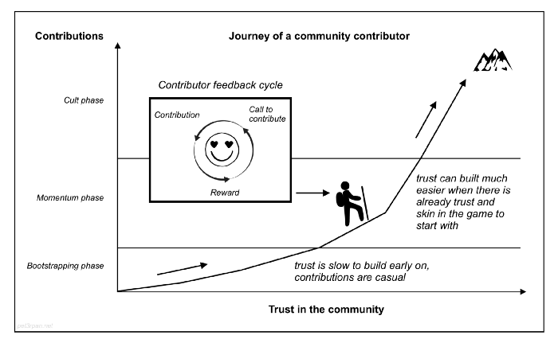

Source:  1kxnetwork <a href="https://medium.com/1kxnetwork/how-to-grow-decentralized-communities-1bf1044924f8">How to Grow Decentralized Communities</a>

The above graphic describes a "contributor's journey" that starts with a brand new participant and takes them along a path of becoming a high-value, trusted pillar of the community. Throughout the journey, they are motivated by the contributor feedback cycle a.k.a. the *contributor loop* as we refer to it in our model. 

As we discussed in balancing the tensions of building trust vs. taking action, we will want to initially be slow and selective with onboarding new contributors, but we should still be proactively surfacing the best talent within the community. 

The goal is to allow users to self-identify their strengths and talents and then align them as quickly and efficiently as possible with educational material and contribution opportunities related to those talents. Those contributions are then rewarded, which in turn incentivizes the seeking of new opportunities to contribute. 

The entry point for a new user should be like the top of a funnel, where we want to highlight the various opportunities to participate and contribute and then point newcomers in that direction. Ideally, there are clear call-to-actions for the different contribution opportunities right from the first point of entry. The goal is to move them from becoming aware of the project, to engaging with the community on some level, to making their first meaningful act of contribution to the community. 

One way to assist in aligning talents with opportunities is to empower new users to self signal their interests and expertise by offering the ability to select user-defined roles such as "artist", "coder", "writer", "lore crafter" and so on. This way, coordinators of working groups looking for particular kinds of contributions can filter for these types of individuals. 

### The Contributor Pool

At any given time, the DAO will comprise a host of members that are all at different stages of their contributor's journey. It's worth noting that not all contributors are walking on the same path toward the same mountaintop: some endeavor with zeal towards the Everest summit, others are happy to party at Basecamp. 

While there is a lot of exciting potential for empowering players to mold and shape the world they inhabit, there is wisdom in walking before we run while getting the hang of being a DAO. In the beginning, it's important that we be especially selective about who initially seeds the contributor pool because they will set an example that will set the tone for all those that come after them. 

Technically, any member of the DAO can submit a proposal to do just about anything, but pragmatically speaking we'll want to establish a pool of high-quality contributors we can rely on for ongoing and operational work. Most of these will be members of proposal-defined groups or squads.

The key characteristic we want to select for in early contributor roles is an *entrepreneurial mindset*. While effective leadership is essential, a decentralized organization depends on a core pool of contributors that aren't waiting around for someone to tell them what to do. This means individuals that take the initiative to find opportunities to contribute and take responsibility for their actions. The ideal contributor's self-driven efforts are carried out transparently, collaboratively, and in alignment with the purpose and principles of the DAO. 

### Defining Contributors

From the community, the goal is to surface the highest quality contributors for the contributor pool. From the contributor pool, the goal is to surface the best ideas that are in alignment with the purpose, principles, and goals of the DAO. At any given time, the pool of contributors will be comprised of:

1. **Defined roles**: Usually defined via a proposal and may include salaries or other recurring compensation streams.
2. **Vetted contributors**: Trusted to take on specific tasks.
3. **Aspirants**: Unvetted contributors self-selected as interested in contributing. 

In addition to proactively supporting those who self-signal their initiative and interest, the various groups within the DAO can recruit for specific needs they have via posting opportunities:

- **Job openings**: A defined role opening. 
- **Projects**: Essentially soliciting a Request for Proposal to take on a particular type of project. 
- **Quests**: Specific tasks defined by a leadership position or multi-sig (see more in Quests)

### Compensating Contributions

There are three main ways to compensate contributors:

1. Non-financial rewards (Universal Achievement System)
2. Native token ($ORE)
3. ETH

Some combination of these rewards will be defined at different levels and offered to contributors in various forms:

- Direct compensation via a proposal (e.g. one-off projects)
- Salaries for defined roles and lead positions defined in proposals, perhaps via automated payment tools
- Rewards for quests and bounties predefined by group leads
- Something like [Coordinape](https://coordinape.com/) as a peer-based compensation option, or as a social "tipping" or bonus system on top of base pay rates defined in proposals

### Quests 

Quests could be any small task that the DAO needs completing. Some may be reoccurring, and some may be a one-time deal. The rewards for completing these tasks could be some combination of world XP, $ORE, or possibly future in-game items. Quests represent a great way to get new people to leap into their first formal contribution to the world. 

One interesting possibility is that we could allow aspiring pilots that don't have a ship to level up by completing quests and be paid in $ORE. This could eventually allow them to participate in the in-game ship auctions and have a shot at winning a ship of their own, which would then allow them to participate in the rest of the ecosystem as a full member.

## The Learning Loop

### Onboarding

One important aspect of improving the on-boarding process is to not only *offer* educational resources but to effectively *connect* those resources to where they are most relevant. It could be part of the role of those in the Academy working group to identify how to get the minimum effective dose of relevant information to the right people in the right places at the right time as efficiently as possible. Perhaps quests could be issued from the Academy for finding pain points in the on-boarding process that could benefit from contextual educational resources or pointers. 

At a minimum, we will want accessible guides and documentation on everything related to the game and DAO. We could then take it a step further by extending our gamified systems to the learning process. 

We could create a series of courses that players would progress through and "pass". Passing a course could be incentivized by a number of types of rewards:

1. **Achievement badges**. Ideally, unique to each course. 

2. **World XP**. Completing courses could be an essential source of world XP and leveling up. 

3. **Unlocking levels**. For the most advanced levels, tests could call for submissions that would need to be manually reviewed by staff members of the Academy working group that hold the same or higher level. 

4. **In-game loot**. For some courses, there could be actual in-game rewards. Ideally, we would avoid handing out $ORE directly, and instead offer in-game items that are proposed on the roadmap. 

The gamified learning portal could integrate well with the level system, and perhaps even be the primary interface for the level system. In fact, we could take this a step further and build an entire "community dashboard".

## A Community Dashboard

A nice way to bring all of these ideas together is through some type of web-based community dashboard. Within one well organized, UX optimized interface we could include information such as:

#### Governance
- View active proposals
- Vote on active proposal
- Submit new proposal

#### Working Groups
- See listing of current role openings
- See list of all open quests grouped by working group
- If part of a working group, see all active approved proposals assigned to working group 

#### Activity Feeds
- The governance feed (recently passed proposals, recently failed proposals, recently submitted proposals, recent votes)
- A feed of community events (level ups, achievements earned, quests completed, projects completed, new high score on the leaderboard)
- The killmail feed (most recently destroyed ships)
- Most recent NFT sales on exchanges

#### Achievements
- Level
- Current XP, XP needed for next level
- Badges

#### Education
- Browse topics and search World Codex (community docs)
- View Currently available courses to take
- View completed courses
- Continue active courses

#### Reporting
- Economic reports
- Treasury / budget reports 

#### The Game Leaderboard
- High scores for pilots (wallets)
- High scores for individual ships

#### Other Possibilites
- A forum (e.g. Discourse)
- DAO tooling integrations
- A DAO leaderboard

In the "achievement" portion of the dashboard, your progress toward advancing to the next level could be tracked in real-time, and you could be given a summary of what you still need (e.g. 45 more XP, this or that achievement badge, X number of completed quests, etc). For the higher levels, perhaps once all the prereqs were completed you would unlock the ability to take a quiz or test that would advance you to the next level upon passing it. 

This dashboard could be the second major window into the virtual world after the game interface. Perhaps we could one day even conceive of a unified "world interface" that combined the game and community interfaces. 

## Next Steps

The goal of this paper is to spark the imagination for what the future of the project could look and operate like. As a decentralized project, we all retain a voice in how this unfolds. The truth is that decentralized governance is a complicated and rapidly evolving subject and it's unlikely any one of us will have all the answers.

The first priority is in reaching competency and stability with the launch version of the DAO's structure. To that end, we should all become familiar and comfortable with the [current operating model](/dao/) to prepare ourselves for co-creating the next iteration.  

