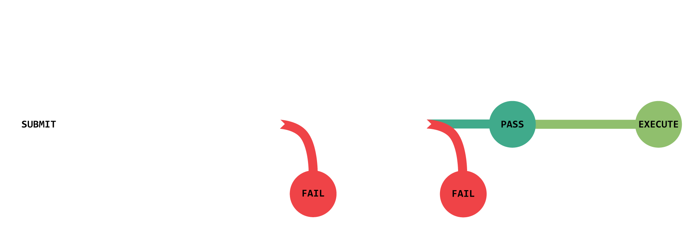
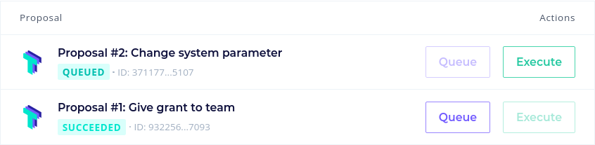
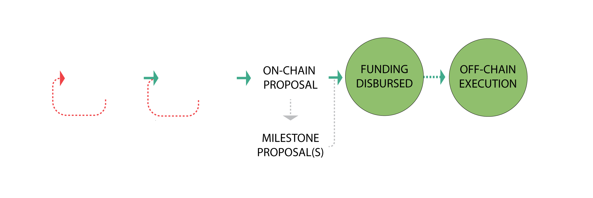
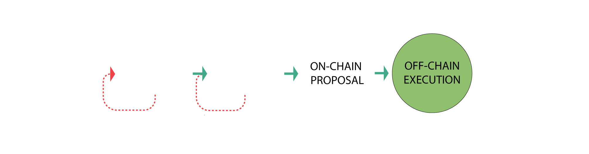
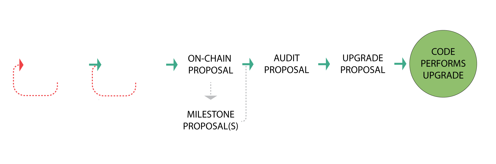

# Proposal Process

Anyone with 5 ships worth of voting power (via ship ownership or delegation) can submit a proposal. 

Once submitted, proposals become active and enter a 6-7 day voting period. In order to pass, a proposal must reach quorum with a majority (51%+) of votes in favor. To reach quorum, at least 4% of total voting power must vote on the proposal. After a proposal passes there is a two day delay before the execution of any code that was contained in the proposal. This two day "timelock" period allows those who may disagree with the proposal to exit the project before the changes take effect. 

## [How to submit a proposal on Tally](https://docs.tally.xyz/user-guides/create-a-proposal)

## Executing Proposals

When a proposal reaches quorum (a minimum number of votes) and has the majority of votes in favor, it can be queued for execution. Queueing a proposal simply marks it ready for execution after a certain amount of time, and allows people who were not in favor time to react. After about a week, anybody can execute the proposal. Executing proposals runs the code for them, as defined when the proposal was made. The UI for doing so can be found below, courtesy of [Tally](https://www.tally.xyz/).

## Proposal Requirements  
- Must have at least 5 ships worth of voting power to submit a proposal. This can be a combination of ships staked directly and votes delegated by other pilots. 
- Must conform to the proposal template guidelines.
- Must be realistic, narrowly scoped, detailed, and reasonably budgeted based on fair market rates.
- All contract upgrades must pass a Solidity Finance code audit. 
- All game contract upgrades that have economic or balance implications must pass a Machinations audit. 

## Appropriate Use Cases for Proposals
The primary use case for proposals is to make a significant DAO-wide decision, usually about how to allocate treasury funds. Proposals are not for day-to-day decision-making or minor tasks. The idea is that proposals can greenlight and fund the creation of anything the DAO may need or want to accomplish, including operational concerns like [working groups](/org/), dedicated roles, multi-sigs, and leadership positions that are given domain-specific privileges and the authority to efficiently make more granular decisions on the DAO's behalf. 

## Proposal Categories: 
1. **Funding** 
	- Internal projects (one-time funding)
	- Grants for outside contributors (one-time funding)
	- Create, remove, or modify an operational group or role (on-going funding)

2. **Resolution** 
	- For administrative community or governance matters
	- Can officiate decisions that need to be ratified off-chain (e.g. this document)
	- Typically no funding requested
	- Examples include role changes, clerical concerns, rule changes, discord server changes, new regulations, and new processes. 
	
3. **Contract Upgrade** 
	- Add or modify governance code
	- Add or modify game code
	- Will normally be the final milestone of previous funding proposals

## Proposal Naming
Most DAOs find it useful to conform to a numbered naming standard for proposals. We'll include a naming standard  in the description field of each proposal, since no specific title or name field for proposals has been defined in the code at this time.

We will use CDP (Citadel DAO Proposal), where the first proposal will be CDP 1, and so forth. 

More info on this process will be available on the Discourse forum. 

## Submit On-chain Proposals on Sunday 

All on-chain proposals should be submitted on Sunday. Voting on all proposals will thus start and end on Sunday.  

### Rationale

In an effort to make participating in governance more accessible, we'll experiment with launching all new proposals on a specific day. Since the voting period is one week, this would mean voting for all proposals would start and end on the same day. This way, everyone knows when to vote without having to track multiple individual voting timelines. This should be considered an experiment that can be reviewed, changed, or discontinued if it's found to be ineffective.

### Exceptions

If a proposal is time sensitive (but not an [emergency](/dao/powers/#emergency-proposal-multi-sig)) and waiting for Sunday is an issue, a proposer can request written approval to submit the on-chain proposal on a day that isn't Sunday from a member of the Core Team on the Draft Proposal. This process can be amended via a community resolution at any time. 

## The Proposal Process

### **Step 0: Vet Idea on Discourse Forum**

While we are still finding our footing, all proposals must first be vetted off-chain on the community Discourse forum. This is an approach many DAOs take and we will follow their example for now. Proposals that don't go through this process are subject to being vetoed. 

1. **Pitch Idea**: Submit a post on the Discourse forum using the Pitch template and collect votes and feedback for a minimum of 3 days. If it receives majority positive votes then proceed to creating a draft proposal, otherwise rework idea based on community feedback (or put it on ice).

2. **Off-Chain Draft**: Submit a post on the Discourse forum using the Proposal template and collect feedback for a minimum of 3 days. If it receives majority positive votes and doesn't need any further modification then proceed to an on-chain proposal, otherwise rework and resubmit another draft based on community feedback. 

### **For a Funding Proposal** 

1. **Submit funding proposal**. Funds will be disbursed if passed. 

2. **Submit follow-on funding proposal(s) (if necessary)** If the requested amount is large, it's best to break up work into multiple milestone based proposals that show incremental work and request follow-on funding. This is also appropriate in continuing funding for operations related expenses. 

### **For a community resolution** 

- **Submit a resolution proposal**. In most cases no funding is requested and no code is executed. It's up to the appropriate appointed members of the Core Team or DAO to ratify the content of the proposal if there is no code to execute. 

### **For a Contract Upgrade** 

1. **Submit initial funding proposal** pitching the changes or features to be developed. Even if self funding, this initial proposal is standard practice to get community buy-in before proceeding to requesting an audit. 

2. **Submit funding proposal for audit(s)** that includes audit cost quotes.  The proposal will disburse funds directly to audit partner(s) if passed. 
 
3. **Submit a contract upgrade proposal** to execute the upgrade code that has passed the audit(s) and request final compensation if necessary. This proposal will upgrade the relevant contracts and disburse any requested funds if passed.

## Budgeting and Compensation
- Compensation for contributions can be requested in ETH, $ORE, or a combination thereof depending on the nature of the work being done. The community can elect to establish guidelines for this if necessary. 
- A minimum ratio of ships to reserve funds in the treasury should be maintained as we go forward for the health of ecosystem. The Core Team will release regular economic reports related to this. 
- Budgeting will be an on-going conversation and will require further discussion about apportioning funds for proposals and compensating contributions. 
- In general, we will want to be fairly conservative with the use of treasury funds out of the gate.   

## Proposal Pitch Template
- **Synopsis**: 1 sentence description.
- **Category**: Funding, Resolution, Contract Upgrade
- **Description**: Describe the main idea. 
- **Rationale**: Supporting arguments.
- **Who**: List everyone involved. 

## Proposal Templates
### For a Funding Proposal or Contract Upgrade
- **Synopsis**: 1 sentence description.
- **Link to Pitch or Draft**: If a Draft Proposal, include link to successful proposal pitch on Discourse. If an on-chain proposal, link to successful Draft Proposal. 
- **Category**: Funding
- **Summary**: 2-3 sentences.
- **Description**: 
	- **What**: Detailed description, include any relevant supporting data
	- **Why**: Main supporting arguments
	- **Who**: List everyone involved any relevant credentials and community accolades. 
	- **When**: Time scales and due dates (if applicable)
	- **How**: Implementation pathways, the specific steps that need to be taken to implement the proposal, including prior consultation of key community members that would be involved in implementation. 
- **For and Against Arguments**: Discuss the positive and negative potential ramifications of the proposal. 
- **Criteria**: What conditions, metrics, KPIs, or deliverables represent successful completion of work or goals?
- **Milestones**: If project has a large scope, it's best to break it into separate milestone proposals. They should all be outlined here, as well as any work that has been done if this is a subsequent milestone proposal. 
- **Cost breakdown**: Detailed breakdown of how funds will be used.
- **Total projected cost**: Total estimated cost of the scope of the proposal. 
- **Funds requested now**: Funds that will be automatically disbursed if proposal passes. 

### For a Resolution 
- **Synopsis**: 1 sentence description.
- **Link to Pitch or Draft**: If a Draft Proposal, include link to successful proposal pitch on Discourse. If an on-chain proposal, link to successful Draft Proposal. 
- **Category**: Resolution
- **Summary**: 2-3 sentences.
- **Description**: 
	- **What**: Detailed description, include any relevant supporting data
	- **Why**: Main supporting arguments
	- **Who**: List everyone involved any relevant credentials and community accolades. 
	- **When**: Time scales and due dates (if applicable)
	- **How**: Implementation pathways, the specific steps that need to be taken to implement the proposal, including prior consultation of key community members that would be involved in implementation. 
- **For and Against Arguments**: Discuss the positive and negative potential ramifications of the proposal. 
- **Criteria**: What outcome satisfies the content of the resolution? 

## Executing Code
Proposals can execute code if passed, including performing treasury disbursements and contract upgrades. 
#### See [Encoding Transaction Data](https://articles-orzd3tqhl-thecitadelgame.vercel.app/docs/encoding-transaction-data) for more information on this. 

## Example Pitches and Proposals
The Core Team will submit several examples we have planned on the Discourse forum after launch. 

## Examples of Proposals in Other Projects
- [Yearn - YIP-61: Governance 2.0](https://gov.yearn.finance/t/yip-61-governance-2-0/10460)
- [VitaDAO - VDP-1 VitaDAO Governance Framework](https://gov.vitadao.com/t/vdp-1-vitadao-governance-framework/40)
- [Index Coop - Index 2.0 Leadership, Governance and Decision Making (Pods, Nest and Wise Owls)](https://gov.indexcoop.com/t/index-2-0-leadership-governance-and-decision-making-pods-nest-and-wise-owls/3214)
- [Index Coop - Community Ownership & Compensation V2 Proposal](https://gov.indexcoop.com/t/community-ownership-compensation-v2-proposal/3361)
- [Decentraland - DAO Governance Proposal Stages](https://governance.decentraland.org/proposal/?id=5193f850-5c00-11ec-9c52-0d9746a59174)
- [BanklessDAO - Founding a Project Management guild 2.0](https://forum.bankless.community/t/founding-a-project-management-guild-2-0/3251)
