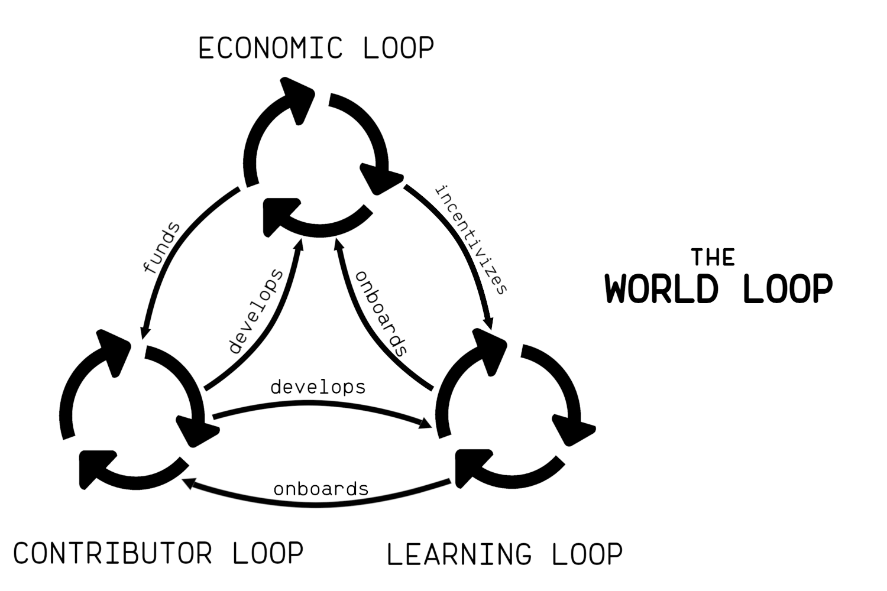
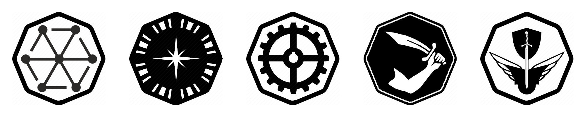
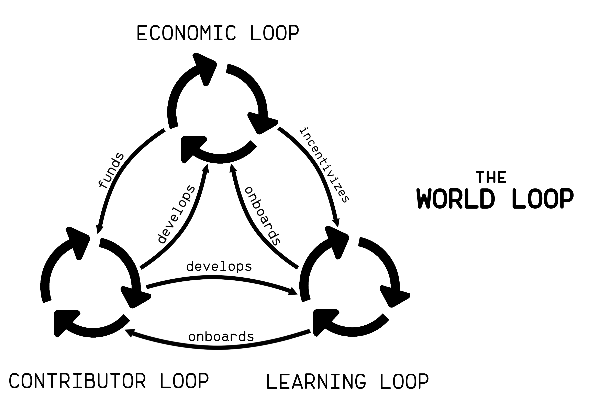
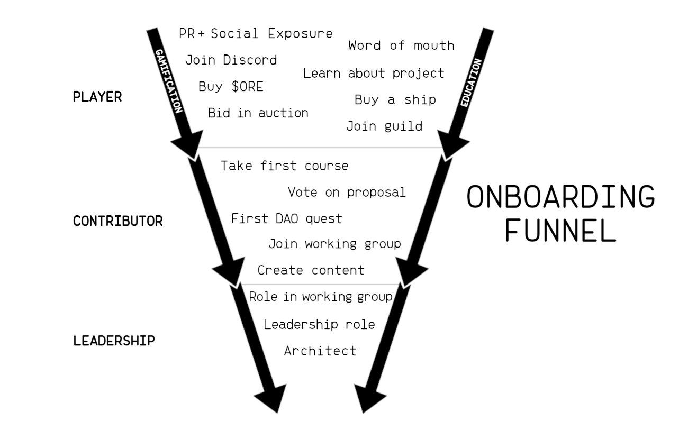

# Organizing the Citadel

The launch of The Citadel will represent a fairly radical experiment in decentralizing a blockchain gaming project. This is acczmplished via the Citadel DAO, to which the majority of both funding and ownership are handed trustlessly via smart contracts on launch day. Once this happens, the founding team will become community members alongside everyone else with the exception of a set of well defined and programmatically revokable privileges appropriate for overseeing the early phases of the game and project. There are many opportunities and challenges that await us on this journey, and it will be up to all of us in the community to decide how we are to meet them. 

At the center of this community venture is the DAO and the infrastructure necessary to sustain it. The team has spent the better part of the past several months specifically working on laying the groundwork for a robust DAO and governance system in order to feel confident in handing over control to it from the outset. Transferring ownership of all game contracts to the DAO and funding its treasury with the majority of the proceeds from the mint is the crucial step that separates a real DAO from a DAO-in-name-only.  A true DAO is the project's primary beneficiary; it runs the project, owns the project, and ultimately *is* the project.

With that said, the launch version of the DAO will provide the essential foundation on top of which it will be up to the community to evolve into an effective, efficient, and self sufficient decentralized game development organization. The team will seek to assist in this effort in every possible way, but ultimately it will take all of us to reach the full potential of decentralized co-creation and self governance. In this paper we will explore a vision of what that could look like. 

## The World of the Citadel

Before we dive into the particulars of the structure and design of a DAO, it might be useful to orient ourselves around the unique implications of what it is we're building and how that relates to the way we go about doing so. One perspective is that we're building an "on-chain game". The core characteristics of on-chain games are that they are fundamentally online, multiplayer, and *persistent* games. You can interact with other players, and the consequences of those actions *persist* indefinitely on an immutable blockchain record of the history of the game world. 

From here, our game moves beyond the DeFi roots of many on-chain games and begins to create an immersive 2D environment. In this environment, you have an avatar (a spaceship) that has *agency* in two dimensions. It can decide where it goes, and when, and what it does when it gets there. These are very simple mechanics, and yet it forms the kernel for a much expanded universe of possibilities. So we have the beginnings of a multiplayer, online, persistent, immersive world populated by avatars with the agency of how to move and behave. This begins to sound a lot like what would traditionally be called a *virtual world*. 

Will the launch version of The Citadel constitute a proper virtual world? One meta-analysis of the literature on the subject came up with the following definition:

>A persistent, simulated and immersive environment, facilitated by networked
computers, providing multiple users with avatars and communication tools with which to act
and interact in-world and in real-time.

<a href="https://www.scss.tcd.ie/publications/tech-reports/reports.13/TCD-CS-2013-10.pdf">What is a Virtual World: Definition and Classification</a>

Under this definition, the Citadel could arguably fall under the category of virtual worlds that were common in the 80s and 90s which relied heavily on text-based and 2D interfaces. At launch, perhaps we've reached a "minimum viable world" threshold, and we will undoubtedly move in the direction of ever more depth and immersive features after launch. 

## An On-chain, DAO Owned Virtual World

With the Citadel, we refer specifically to an **on-chain, DAO owned virtual world**. Let's break this down:

On-chain | DAO Owned | Virtual World
-|-|-
Immutable | Co-creative | Immersive
Persistent | Self organizing | Self perpetuating
Real world value | Communal | Psychologically inhabitable
Decentralized | Autonomous | Intrinsically gamified

### On-chain

**Immutable and Persistent**

A major benefit of a persistent world living on the blockchain is that is benefits from the [anti-fragile persistence](/persistence/) inherent to blockchains. Of all the types of games, virtual worlds benefit from robust persistance provided by the blockchain most. Unlike many current blockchain games and metaverse projects, on-chain games host *all* of their game assets and game state on-chain. The events of the world are recorded in an immutable ledger by default. Theoretically, this allows an on-chain persistent world to live on indefinitely. 

**The World is Virtual, the Value is Real**

One of the big selling features of a blockchain game is that the pieces of the game world have real world value and are actively traded on sanctioned marketplaces with non-trivial liquidity. A significant implication of this is that since this creates an ecosystem that is connected to real world liquidity, *contributions to the ecosystem* can also be approximated in terms of real world value. This means that it's possible to be financially rewarded for both in-game activity and contributing to the DAO in the same greater virtual world economy. In other words, in this virtual world your actions can affect and create real world value. 

### DAO Owned

#### Self Organizing

Decentralized and autonomous governance requires a fundamentally self organizing structure. Even if we are to guide this process in the direction of the desired outcomes, with true decentralization and autonomy comes the surrender of control to what emerges spontaneously. In a self organizing, DAO owned virtual world we participate in a creative process that could result in a world and structure that *emerges* as much it is designed. 

##### Co-creative

Central to the process of self organization is the ability for all autonomous actors in the system to modify or build on the system -- to make their own independent contribution. In a virtual world, this means the players (or avatars) of the world have the ability to co-create the world they inhabit collaboratively. Ownership by a DAO is one way to enable co-creation in an on-chain world. This means we should give preference to flexibility and loose coupling when it comes to designing structure and hierarchy. 

### Virtual World

#### Psychologically Inhabitable

> A virtual world is an immersive virtual environment that users can psychologically inhabit. 

<a href="https://encompass.eku.edu/cgi/viewcontent.cgi?article=1018&context=ugra">Projecting the self into a virtual world</a>

One characteristic that sets a virtual world apart from many other types of products a DAO might be building is that it is *psychologically inhabitable*. That is, you can have the subjective experience of "occupying" the virtual space. This becomes especially interesting when we think of participating in a DAO as an extension of inhabiting the world in which it owns and builds. 

#### Self Perpetuating

Another characteristic that makes a virtual world a unique product is that like the real world, a virtual world could be said to exist for its own sake (to some degree). Unlike most products that are designed to solve a particular problem, the market fit for a virtual world crosses the threshold of "interactive entertainment" and begins to adopt a self perpetuating will to simply *be*. The [telos](https://en.wikipedia.org/wiki/Telos) of the world is to go on being a world as an expression of the collective will of its autonomous constituents. 

Like a guild, members of the organization may feel they belong to something fun and special they would like to see go on. Like a nation state, denizens of the world may feel invested in the well being of their space and their community. This existential motive competes to some extent with the profit motive that most organizations operate around. This might change the fundamental assumptions we make about what users care about in our project. 

#### Intrinsically Gamified

In a way, applying gamification strategies to non-games requires inventing a pseudo virtual world context in which virtual rewards matter. Why does the user care they are rewarded with achievement titles, badges, points, or other virtual accolades? Beyond superficial dopamine manipulation, virtual rewards and accomplishments only *matter* in relation to the context in which they exist. From the user's perspective, the more meaningful the context the better. Ideally, your rewards are part of a greater system that other people participate in and who are able to see and recognize your rewards as valuable. 

When the product a DAO owns and builds *is* a virtual world, there is no need to invent an artificial virtual context for rewards to matter in -- gamification is native to the platform. 

## Decentralized Autonomous World

The Citadel is at the intersection of all the above characteristics, which places us into somewhat uncharted territory. 

The truly unique aspect of an on-chain DAO owning an on-chain virtual world is that one becomes an inextricable part of the other. Rather than an on-chain game that just so happens to be owned by a DAO, we could instead recognize this to be a singular on-chain world that is owned and operated by its players. It accomplishes this via governance mechanics that  are as native to the world as any other mechanic. 

For example, we'll talk later about a "working group" called the Council, a type of oversight committee for the DAO. Fleet Commander has been "reporting to the Council" from the start of the project from a lore perspective. "The Council" could theoretically exist in-game in some form or another. Voting on proposals occurs in the "Parliament" in the lore, which could also theoretically actually exist in-game -- certainly via an in-game interface. 

The point is that all the qualities that apply to the virtual world can also apply to the DAO, since they are one in the same. The DAO aspect of this world has far more *potential* to be fun, immersive, and intrinsicially gamified than your typical DAO. The "organization" in our "decentralized autonomous organization" could be said to live and operate in the world it owns and builds -- a decentralized autonomous *world*. 

The end goal of a decentralized autonomous world is to establish a virtual space where participants can create, play, socialize, learn, and teach. They can collaborate on building the virtual realm they themselves would most like to inhabit. Their contributions, both large and small, can be rewarded in ways that are meaningful both to the virtual world itself and to the real world. Players will not be asked to "play to earn" via joyless mechanics; they will be invited to *inhabit the world* they own and be rewarded for the value they contribute along the way. 

This idea of decentralized autonomous worlds may sound very well in theory, but now we must begin to imagine how this might all work in practice. With the help of gamification strategies, a robust economic engine driven by the game loop, delegating domain-specific authority to trusted community members, community collaboration tooling, and prioritizing the on-boarding of new participants via gamified learning, we might begin to see that a decentralized virtual world actually holds tremendous potential as a high functioning autonomous organization. 

Let's first look at some ideas on how we could go about structuring the DAO. 

## Evolving the DAO

Source: 1kxnetwork's excellent <a style="font-style: italic" href="https://medium.com/1kxnetwork/organization-legos-the-state-of-dao-tooling-866b6879e93e">Organization Legos: The State of DAO Tooling</a>

When we look at what the above chart refers to as a DAO 1.0 versus a DAO 2.0, the launch version of Citadel DAO will land closer to the 1.0 model. The majority of day-to-day project management will still be concentrated with the core team and community decision making will usually come down to a DAO-wide democratic vote on a proposal. So there will be DAO 1.0 way of getting things done initially, and the team will provide as much documentation about how to go about this as possible. 

Meanwhile, the goal should be to steadily move toward a 2.0 model with better defined areas of responsibility and more delegation of domain-specific authority to trusted community representatives. 

## Working Groups

One approach other DAO based projects have implemented successfully is the use of working groups. The goal with working groups is to formalize subject domains that are important to the project into functional units that are assigned responsibility for that domain. Using an approach like yearn.fi's [constrained delegation](https://gov.yearn.finance/t/yip-61-governance-2-0/10460), limited executive decision making power can be conditionally granted to individuals that the community trusts to represent them and their best interests. 

This approach solves a big problem with self-governance in that a pure direct democracy decision making model doesn't scale very well. With working groups and constrained delegation, we can empower trustworthy and capable community members to act independently on the DAO's behalf. We can define specific roles across the DAO and in each working group that are granted specific privileges appropriate for carrying out the objectives of that role. We can then approve transparent funding for the execution of the role mandate, and hold those using the funds accountable. 

The creation of a privileged role and the assigning of community members to that role will still happen via governance proposals, so each community member still retains a voice in all of this. Meanwhile, the DAO is able to operate efficiently at scale on a day-to day-basis. 

Some DAOs choose to standardize a type of role hierarchy within working groups which could look something like the below examples:

|Role      | Description      | Required Level|
|----------|------------------|------|
|Architect | Working Group Lead | 9    |
|Arbiter   | Project Lead     | 7    |
|Associate | Working Group Team Member   | 6    | 
|Freelancer| Quests, One-off tasks | 3    |

The goal here is not to create a strict "boss-employee" dynamic; after all, everyone involved is ultimately from the community and working for the community. Rather, we can optimize for the "minimum viable hierarchy" that enables efficient decision making and provides oversight and accountability for the use of treasury funds. 

The proposed groups above are a starting point to get us all thinking about how the DAO could be structured.

**Core Team**

After launch, the core team is effectively going to be acting as the first and primary working group. The bulk of the areas of responsibility mentioned above will start out under the core team's umbrella. The goal is to hand many of these responsibilities over to community working groups over time. The key distinction between this arrangement and centralized projects without a proper DAO is that the DAO can technically fire the core team any time they like, since they are essentially just a working group with a limited set of revokable privileges. 

**The Council**

One idea is to have a kind of *oversight* working group  where the group leaders of all other working groups coordinate with one another and make sure efforts are aligned across the organization -- a kind of internal U.N. where a representative from the various autonomous teams can discuss the going concerns. This group could be given special powers in case of emergencies, or perhaps it could be given a veto power for specific types of proposals (e.g. a proposal to drain the treasury). The Architect of the Council (Chief Architect?) could be the closest thing to a community figurehead as there could be in the DAO. 

**The Foundry**

Community engineers. Will work closely with and be supported by the core team as well as the resources the core team develops. An important role for this group could be to help the community develop and execute proposals, which would represent a huge step towards self sufficiency. The Architect of the Foundry could act as a community CTO. 

**The Studio** 

Artists, writers, videographers -- anyone with creative skills to offer. Much of how the world will come to look could be dreamed up here. The Architect of the Studio could act as a Creative Director. 

**The Treasury**

Economic oversight and reporting, treasury management, budgeting. Will be important to recruit individuals with strong credentials related to these fields (e.g. ideally at least one CPA). The Architect of the Treasury could act as a type of CFO. 

**The Academy** 

This could be an interesting mix of both educators and UX optimizers. The Academy's primary mandate could be to on-board new players, welcome and integrate them into the community, and walk them through their contributor's journey as efficiently as possible, which will involve a mix of strategies and skills. The Architect of the Academy could essentially be the Dean of Education as well as a sort of "Chief Gamification Officer". 

**The Station**

This is probably one of the first examples of a working group most people would imagine existing since we already have a version of this in the Discord. The community team we already have would likely transition into this working group where they would have more direct oversight by the DAO. We could expand on this to include more efforts to look after the well-being of community members and team members of working groups, including mental health initiatives, conflict resolution (mediation), and establishing community standards. The Architect of the Station would likely fill a role similar to a Community Manager.

**The Embassy**

The Embassy would concentrate on representing the Citadel to the public and growing the playerbase: PR, social account management, growth strategy, collabs, and the like. It could act as a real embassy for guilds and similar gaming communities, as well as handle external recruiting for working group positions if that's ever needed or appropriate. The Architect of the Embassy could be both Chief Ambassador and Chief Marketing Officer. 

### In Practice
The working group model allows us to transition from a situation where every governance decision and use of treasury funds would require a new proposal and DAO-wide vote to a situation where the majority of small to medium sized decisions are made by trusted representatives in the Architect, Arbiter, and Associate roles. This would mean that we could vote on an entire project that would bundle together a dozen separate work items into one. Now there's only one proposal to vote and reach quorom on instead of twelve, and we empower dedicated roles to execute and oversee the work as they best see fit without needing to ask for additional permission. 

For example, we could vote to assign the project of "create a line of 16 new ship skins" to an Arbiter of the Studio and provide them with the use of e.g. 2 ETH to compensate vetted artists within the Studio that hold Associate and Freelancer roles for each skin they contribute. 

Establishing working groups could be a great step towards building a high-functioning decentralized organization. Another idea that we can explore to incentivize participation and community contribution is in expanding the idea of the game world to include the entire organization and community at large by making participation fun and rewarding across the entire ecosystem. 

## Gamification

We have established that gamification is native to our platform and there are many opportunities for implementing gamified hooks throughout the ecosystem. The term itself has become a bit of a buzzword, so let us define gamification on the basis of how it can be relevant and useful for aligning the interests of hundreds or thousands of autonomous individuals in a decentralized organization.

First and foremost, the goal of gamification should not be to dumb anything down, cater to short attention spans, or hijack dopamine pathways for shallow purposes. The goal should be to: 

1. **Optimize** the user experience across all points of contact in the organization. Find ways to remove friction from all processes, clear away barriers and bloat, and streamline interfaces. 
2. **Incentivize** positive sum action taking amongst free actors. Identify the most important actions or contributions and explicitly recognizing their value via formalized rewards. 

Incentives that convey an increased sense of ownership, social status or recognition, or other intangible rewards should be used wherever possible as these will motivate individuals who are *intrinsically* motivated (long term interest in the project) vs. financial rewards that will appeal more to those who are *extrinsically* motivated (short-term interest, self serving). 

In this way, we can define gamification as the design of positive sum feedback loops using a combination of UX design, process design, and mixed incentive structures.  The goal should be to gamify every aspect of participating in the overall ecosystem in the most holistic way possible. Gamifying governance, contribution, and learning is a powerful way to motivate a collective of autonomous agents in a decentralized organization to collaborate voluntarily and effectively. If done well, it should also be a good deal of fun.

## A Universal Achievement System

At the heart of the gamification strategy could be an achievement system that provides primarily non-financial recognition and rewards for positive contributions and behavior throughout the entire ecosystem. You, the player, are the "character" or "avatar" of this system that earns achievement badges, XP, levels, and special roles. These achievements and titles could follow you around wherever you go in the virtual world, potentially unlocking access to restricted content, privileges, and exclusive benefits. 

In a way, these universal achievements constitute your performance history and record as a player and community member. All your accomplishments would ideally be publicly visible across the primary interfaces. In Discord, this could be represented with special roles and titles. In the game interface, there could be a "trophy room" that displays all your accolades and stats, and perhaps these things could be visible to other players via your in-game profile. Or perhaps there's a dedicated "community dashboard", which we'll explore more later. 

Ideally, this system is implemented entirely on-chain.

### World XP System

World XP (experience points) could be a type of point system that represents the path of the community member. It can be earned in any part of the world (game, DAO, community, courses) but only for actions that are considered positive for the individual's progression and ultimately the world. There might also be XP systems with more limited scope, such a ship or pilot XP system that is specific to game or economic actions. 

In the game, perhaps taking actions for the first time can be rewarded with XP to mark the progress the player has made by doing something new. However, world XP can't be "grinded" for by repeating the same actions over and over again. 

World XP could also be earned by completing educational courses, participating in DAO governance, contributing to or joining DAO working groups, completing DAO quests, or receiving a community award for positive interaction or contribution (Architects and Arbiters of the Station could hand these out). 

### Achievement Badges

The concept of achievement badges takes inspiration from both the in-game achievements most of us are familiar with in modern games as well as <a href="https://poap.xyz/">POAPs</a> (digital mementos). The goal is both to reward valuable, positive actions and contributions as well as to commemorate important steps taken throughout the journey of a community member. They would also be great for recognizing participation in a community event or contest (especially the winners). Many achievements would likely also coincide with earning XP. 

Some badges could unlock special content (e.g. unique ship skins), or even be pre-requisites for gaining access to certain levels or roles. This becomes especially relevant when we discuss gamifying education later on. 

### Levels

Level|Title | | Level | Title
--|--|--|--|--
1| Visitor | | 6| Master Chief
2| Citizen | |7| Captain
3| Recruit | |8| Admiral
4| Cadet   | |9| Commodore
5| Pilot  | |10| Commander

In most RPG games with a level system, levels generally correspond with reaching a predefined amount of XP and we could borrow the same idea. This allows for quickly identifying how much each member of the community has participated and contributed to the world. 

One use case for levels could be minimum level requirements for gaining access to various community and DAO related privileges. It could make sense for leadership roles in DAO working groups to require minimum levels to even be eligible for consideration. 

Another possibility is that levels that generally coincide with senior or leadership roles (Level 6 and up) can't be earned automatically and require satisfying a set of pre-requisites in order to considered for manual promotion by higher ranking roles in the DAO. With this approach, we could even consider entrusting special privileges to the highest levels like limited moderation powers in Discord. 

### Quests 

Quests could be any small task that the DAO needs completed. Some may be reoccurring, and some may be a one time deal. The rewards for completing these tasks could be some combination of world XP, $ORE, or possibly future in-game items. Quests represent a great way to get new people to take the leap of making their first formal contribution to the world. 

One interesting possibility is that we could allow aspiring pilots that don't have a ship to level up as high as rank 5 (Pilot) by completing quests and be paid in $ORE. This could eventually allow them to participate in the in-game ship auctions and have a shot at winning a ship of their own, which would then allow them to participate in the rest of the ecosystem. 

## The Game Loop of Autonomous Organizations

 We've thus far established that A DAO structure based on working groups brings us much closer to a functional operating framework as an organization. A universal achievement system provides a toolkit of fun, non-financial rewards that can be used to gamify any part of the ecosystem and motivate collective autonomous action taking. But if we are to take this idea of a truly self sufficient, decentralized autonomous world seriously, we need to think about how it will actually operate as a holistic system. 

One way to envision a self perpetuating, self organizing autonomous world is as a loop of loops. In the above diagram, we can identify three separate loops that all feed into each other to form one master "game loop" of the overall system. 

1. The **economic loop** is powered by and contains the actual game loop. Value  is captured from all economic activities related to the game world into the DAO treasury, which underpins the integrity of the greater ecosystem. This loop funds the development of the game, the DAO, and educational resources in addition to rewarding positive contributions.

2. The **contributor loop** guides new participants down the down the path toward greater engagement and contribution to the project, ultimately culminating in high value core contributor and leadership positions in the DAO. This is where all the core building happens, including supporting and growing the economic and educational loops. 

3. The **learning loop** gamifies learning and integrates it all throughout the virtual world. Learning can be incentivized via a gamified reward system where progression through the educational materiels will yield rewards elsewhere in the ecosystem. The overall goal is to onboard more new participants and help them to become outstanding community members as quickly as possible.  

Let's discuss each piece in more detail.

## The Economic Loop

The economic engine is powered by three different kinds of "activity motors": 

1. **In-game activity**, a.k.a. the actual game loop. Examples include the in-game ship auctions, $ORE being generated and taxed, $ORE being burned, and ships getting destroyed. This activity generates value in the form of both utility and tax revenue that gets sequestered into the DAO treasury. 

2. **Market activity** at this point will mostly be limited to NFT exchanges like OpenSea, which generate royalties that are also sent directly to the DAO treasury, as well as DEX's like UniSwap for exchanging $ORE. This is where outside liquidity for in-game assets and tokens enters the system. 

3. **Community activity** represents the collective actions of all participants in the ecosystem and where the most value creation happens. Funding from in-game and market activity is invested into developing the game, DAO, educational resources, and any other community assets. 

One way our Chief Economist [0xHeimdall](https://twitter.com/HDaxos) likes to think of the DAO treasury is as a type of economic flywheel that is able to frictionlessly capture a portion of the value spun off of the various activity motors for long term storage. This long term store of value provides real backing to the floor price of game assets (NFTs) and bolsters overall economic stability of the ecosystem.  So long as the the greater world loop is firing on all cylinders, this economic flywheel could theoretically keep accelerating as the value of the overall ecosystem increases. 
 

## The Contributor Loop
A major potential advantage of a decentralized autonomous world project is that it is able to harness and integrate the collective passion and creativity of its participants in real time. The users make the world. Think of how much untapped creative and productive energy is wasted by the millions of fans of traditional franchises who are given neither permission nor outlets to co-create along with the proprietary company. Fan-art of corporate owned IP is more likely to be met with legal action than reward (let alone integration).  The ability to utilize this energy of the commons could be the secret weapon of decentralized creative ventures like the one we're building. 

The challenge is in how best to facilitate and incentivize high quality community contributions. 

Source:  1kxnetwork <a style="font-style: italic" href="https://medium.com/1kxnetwork/how-to-grow-decentralized-communities-1bf1044924f8">How to Grow Decentralized Communities</a>

The above graphic describes a "contributor's journey" that starts with a brand new participant and takes them along a path of becoming a high-value, trusted pillar of the community. All throughout the journey, they are motivated by the contributor feedback cycle a.k.a. the *contributor loop* as we refer to it in our model. 

The goal is to allow users to self identify their strengths and talents and then align them as quickly and efficiently as possible with educational materiels and contribution opportunities related to those talents. Those contributions are then rewarded, which in turn incentives the seeking of new opportunities to contribute. 

The entry point for a new user should be like the top of a funnel, where we want to highlight the various opportunities to participate and contribute and then point newcomers in that direction. Ideally, there are clear  call-to-actions for the different contribution opportunities right from the first point of entry. The goal is to move them from becoming aware of the project, to engaging with the community on some level, to making their first meaningful act of contribution to the community. 

One way to assist in aligning talents with opportunities is to empower new users to self signal their interests and expertise by offering the ability to select user-defined roles such as "artist", "coder", "writer", "lore crafter" and so on. This way, coordinators of working groups looking for particular kinds of contributions can filter for these types of individuals. 

Ultimately, the goal is to gamify the contributor's journey as much as possible. An important part of that process will be in offering robust and relevant educational materiels to support contributors along their journey. 

## The Learning Loop

One important aspect of improving the on-boarding process is to not only *offer* educational resources but to effectively *connect* those resources to where they are most relevant. It could be part of the role of those in the Academy working group to identify how to get the "minimum effective dose" of relevant information to the right people in the right places at the right time as efficiently as possible. Perhaps quests could be issued from the Academy for finding pain points in the on-boarding process that could benefit from contextual educational resources or pointers. 

At a minimum, we will want accessible guides and documentation on everything related to the game and DAO. We could then take it a step further by extending our gamified systems to the learning process. 

We could create a series of courses that players would  progress through and "pass". Passing a course could be incentivized by a number of types of rewards:

1. **Achievement badges**. Ideally, unique to each course. 

2. **World XP**. Completing courses could be an important and essential source of world XP and leveling up. 

3. **Unlocking levels**. For the most advanced levels, tests could call for submissions that would need to be manually reviewed by staff members of the Academy working group that hold the same or higher level. 

4. **In-game loot**. For some courses, there could be actual in-game rewards. Ideally we would avoid handing out $ORE directly, but instead offer in-game items that are proposed on the roadmap. 

The gamified learning portal could integrate well with the level system, and perhaps even be the primary interface for the level system. In fact, we could take this a step further and build an entire "community dashboard".

## A Community Dashboard

A nice way to bring all of these ideas together is through some type of web based community dashboard. Within one well organized, UX optimized interface we could include information such as:

#### Governance
- View active proposals
- Vote on active proposal
- Submit new proposal

#### Working Groups
- See listing of current role openings
- See list of all open quests grouped by working group
- If part of a working group, see all active approved proposals assigned to working group 

#### Activity Feeds
- The governance feed (recently passed proposals, recently failed proposals, recently submitted proposals, recent votes)
- A feed of community events (level ups, achievements earned, quests completed, projects completed, new high score on the leaderboard)
- The killmail feed (most recently destroyed ships)
- Most recent NFT sales on exchanges

#### Achievements
- Level
- Current XP, XP needed for next level
- Badges

#### Education
- Browse topics and search World Codex (community docs)
- View Currently available courses to take
- View completed courses
- Continue active courses

#### Reporting
- Economic reports
- Treasury / budget reports 

#### The Game Leaderboard
- High scores for pilots (wallets)
- High scores for individual ships

#### Other Possibilites
- A forum (e.g. Discourse)
- DAO tooling integrations
- A DAO leaderboard

In the "achievement" portion of the dashboard, your progress toward advancing to the next level could be tracked in real time, and you could be given a summary of what you still need (e.g. 45 more XP, this or that achievement badge, X number of completed quests, etc). For the higher levels, perhaps once all the pre-reqs were completed you would unlock the ability to take a quiz or test that would advance you to the next level upon passing it. 

This dashboard could be the second major window into the virtual world after the game interface. Perhaps we could one day even conceive of a unified "world interface" that combined the game and community interfaces. 

## Next Steps

The goal of this paper is to spark the imagination for what the future of the project could look and operate like. As a decentralized project, we all retain a voice in how this unfolds. The first priority is in reaching competency and stability with the launch version of the Citadel structure. To that end, we should all become familiar and comfortable with the current operating model before we look at how we might co-create the next iteration. 

