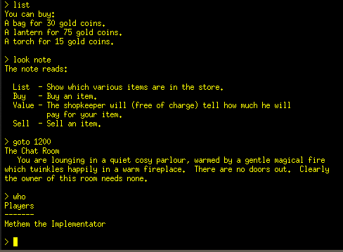
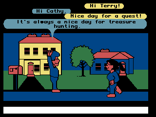

# Designing Worlds

At the time of its release, the Citadel will likely represent one of the most sophisticated entirely on-chain game products in existence. Moreover, the game that will be playable immediately upon minting a ship will address the key issues many prior on-chain games have struggled with both by its technical rigor and sustainable economic design. This presents some interesting opportunities as we project out into the future and I mean to explore some of them here.

I’ll start by briefly discussing what’s going on in the greater blockchain gaming space and how the Citadel fits into it.

## The Problem with Metaverse Projects

The reality is that most high profile blockchain gaming projects are primarily off-chain affairs. These projects seek to first build an elaborate off-chain game product and then design an on-chain ecosystem to meet the specific requirements of *their* off-chain implementation. Consequently, we end up with a new bespoke metaverse ecosystem for every metaverse project. I believe this approach is backwards.

The trouble with off-chain technology is that it suffers from what I think of as *fragile persistence*. The integrity of traditional software systems has a way of eroding over time; bits tend toward rotting. When we talk about multiplayer systems that depend on network resources and central databases, this tendency only compounds. These off-chain systems aren’t very good at *persisting* long term. The question is not if the game server is eventually going offline, it is when. Even the longest lived surviving examples will inevitably succumb to the fragility of their off-chain infrastructure requirements because their continued existence depends on commercial viability (or at least continued funding).

One of the leading sales pitches for integrating tokens and NFTs into traditional games speaks of persistence and composability of game assets. The popular notion is that merely tokenizing a game asset enshrines it into an everlasting digital object that can be used across the "metaverse" for all eternity. While I wholeheartedly share in the enthusiasm for the promise of this concept, my concern is that this will rarely end up being true under the current paradigm. The reality is that these theoretically immortal on-chain assets (with inherently robust persistence) are very tightly coupled to off-chain software systems (with inherently fragile persistence). When the off-chain bits go offline or become outdated, the on-chain ecosystem that was pegged to it ceases to be relevant. Sure, it still exists — but in what context and for what purpose? The utility and relevance, in other words, are not persistent even if the token is. A tokenized digital object that exists in a vacuum tends to end up in your hidden folder.

The goal should be to decouple the on-chain ecosystem from the off-chain infrastructure — the question is how this might be accomplished. I see two main strategies for going about this. The first is to simply put everything that matters about the game on the blockchain if possible.

# On-chain Games

It’s worth asking the question: why bother making an on-chain game? The technical limitations on blockchain data storage, speed, and computation are extreme when compared to what’s possible with off-chain tech. If we take a clear eyed, sober view of what is actually happening in the NFT space I think some of the motivation can be explained by the unspoken call to arms of creating utility for NFTs of essentially any kind at all. Utility for utility’s sake creates a lot of excitement that tends to be good for price floors of NFT collections. To a certain extent, I think people just want to see what’s possible with the technology.

For me, the big deal about blockchains is that they supply antifragile persistence via their decentralized architecture. I see the most compelling aspect of on-chain games as the antifragile persistence they can provide not only to the game assets in the form of NFTs but also to the game state via everything happening on smart contracts and tokens. If we truly seek to live up to the promise of a persistent, composable, interoperable metaverse, then we should be moving game state on the blockchain as much as possible along with game assets.

It is this shift to both game state and game objects living on the blockchain that represents one of the big ideas of the application of blockchain technology to gaming. It means that the core truth of the game world will persist no matter what fate befalls the off-chain apparatus it interacts with.

Of course, this is all very well in theory but in practice most off-chain games won’t be able to store the bulk of their game state on-chain with current blockchain capabilities being what they are. This can and likely will improve over time, and perhaps not every game with a blockchain integration needs to do this. Again, the goal is to decouple on-chain relevance and utility with off-chain technological boat anchors. If moving more game state on-chain is feasible and can achieve a looser coupling, then it’s probably a good idea and moves us closer to the end goal.

Of the exclusively on-chain variety of game projects we have seen thus far, most have borrowed generously from DeFi. There appears to be a lot of excitement around this idea of gamifying what are essentially DeFi apps. Probably the biggest innovation being contributed here is exploring the ways in which NFTs can interact with DeFi mechanics. However, while I think gamified DeFi is a valuable and interesting use case that I’m sure will continue to evolve and mature (hopefully with less price cliff schemes), I see the real potential of on-chain gaming as far more grand.

What I think sets the Citadel apart from other on-chain gaming projects is the extent to which it has built a robust decentralized on-chain ecosystem from the outset (to say nothing of the actual game mechanic feature set). This is a foundation that can support not just DeFi mechanics and simple game mechanics, but something far more interesting and broad in scope: a virtual world, or even a multiverse of worlds.

# Virtual Worlds

Of all the types of games that the antifragile persistence supplied by blockchains has profound implications for, virtual worlds benefit the most. Virtual worlds are called persistent worlds as this is their most definitive quality. Simpler games with narrower scopes don’t depend on persistence to the same degree (although they still stand to benefit from interexchange of assets with persistent world ecosystems). I suppose I should disclose that I personally find virtual worlds to be the most interesting type of “game”, and my history in gaming sharply reflects this.

The concept of the virtual world can be traced back as far as one has the determination to find evidence for, but in practice the first non-exotic tangible examples were MUDs (Multi User Dungeons) of the 80s and 90s. These were largely on the way out when I came on the scene, but they make for interesting virtual world case studies as they inspired the majority of all modern virtual worlds (e.g. MMOs) through one lineage or another.

DikuMUD, the MUD that EverQuest was heavily based on (1991)

MUDs were entirely text-based multiplayer virtual worlds where users connected to regional networks and bulletin-board systems via dialup modem initially, and later via the internet. A noteworthy quality of these MUD virtual worlds is that the text-based interface supplied a user-friendly method of empowering players to modify and build out the world: they could simply write how things ought to be or look like. What interests me about MUDs is that they represent a viable example of real virtual worlds using the simplest possible interface on ultra low performance hardware.

The parallels between the early days of what was then called “cyberspace” and the early days of the metaverse are uncanny and fascinating to read about. One early non-MUD virtual world I have only recently discovered was Lucasfilm’s “Habitat”, available exclusively for the Commodore 64 starting in 1985. It was evidently a full featured graphical world designed to accommodate up to 20,000 players where each player had their own house that were in turn organized into townships replete with city streets.

Lucasfilm’s Habitat (1985)

The issues they struggled with back then were both the abysmal performance and capacity of communications infrastructure as well as underpowered consumer hardware (The C64). Their bandwidth bottleneck is reminiscent of the performance bottlenecks of modern blockchains. In a postmortem written by two of the designers of Habitat, they made some interesting observations relevant to the issue of poor on-chain performance:

> “The essential lesson that we have abstracted from our experiences with Habitat is that a cyberspace is defined more by the interactions among the actors within it than by the technology with which it is implemented.”

> “Defining a virtual environment in terms of the configuration and behavior of objects, rather than their presentation, enables us to span a vast range of computational and display capabilities among the participants in a system.”

*The Lessons of Lucasfilm’s Habitat Morningstar and Farmer, 1991*

These insights are derived from several years of experience during the wild west of virtual world experiments and they reinforce my suspicions that the correct way to approach the metaverse is to build the core foundation entirely on-chain.

Ideally, the ultimate truth of the world should be knowable on the blockchain. This truth can then inform any number of dizzying and dazzling front end representations or interpretations. In fact, this should probably be the goal. For a command line client, perhaps an object is represented as the textual description from the metadata. For another more well endowed graphical client, that same object is represented as an animated 3D model with particle effects and rigidbody physics properties. At the end of the day, the object is the same in all cases, since that’s how the blockchain views it. Any interaction with it will be equally meaningful no matter how it is represented. All that changes for the front-end representation is what parts of the standardized metadata schema of the object are selected for rendering (e.g. text description, profile picture, 2D icon, 2D top-down, 2D isometric, 2D side-scroller, 3D, etc).  

The big takeaway here is that the foundation of a robust, decentralized metaverse can start very simply, and entirely on-chain to boot. This is how I view the true value of what on-chain gaming projects are accomplishing right now. Well engineered and designed on-chain games are uniquely well positioned to form the kernel of the future backbone of the community owned metaverse. Collaboration between on-chain game projects on adopting a shared protocol is a win-win proposition.  

## Metaverse as Protocol

Many high budget metaverse projects attempt to create one monolithic virtual environment in what I view as a bid to become the one true “metaverse”, akin to OASIS from Ready Player One. I would rather see the real metaverse emerge as a shared protocol by which an infinite number of distinct virtual worlds interoperate with one another in a communal decentralized ecosystem vs. some monolithic victor of the metaverse wars that tries to be the protocol itself by swallowing the rest of the universe.

The monolithic metaverse approach is always going to be a win-lose proposition, but of course that won’t stop Zuckerberg and the rest from trying their hand. All these proprietary ecosystems are going to be at perpetual war with one another while deliberately limiting or forbidding interoperability beyond their own walled gardens.

A collaborative, decentralized metaverse protocol solves all the big problems I’ve outlined thus far. It’s a win-win proposition for everyone involved. And it’s not just for virtual worlds: it’s for any game that wants to include blockchain elements, even primarily off-chain games.

A protocol for virtual worlds is the most comprehensive model, but each individual project can access as much or as little of the ecosystem as required. The protocol could provide a decentralized virtual world construction kit that could be anything from multiplayer tic-tac-toe to the OASIS (in theory). Is it not better for players and easier for developers to integrate with an existent decentralized on-chain ecosystem than to roll their own for each game title?

The big win of such a protocol is that it could achieve true persistence and composability of digital objects in an interoperable multiverse of worlds and games. An object can have meaningful utility and relevance in a whole host of virtual worlds and games by default just by virtue of being a part of any one of the projects that have conformed to the protocol standards.

I won’t attempt to get into how such a protocol might be designed in this paper, but I wanted to make the case for how the Citadel is perfectly positioned to lead the way on this front. I realize this whole premise is a bit grandiose, but I don’t believe it’s far-fetched and only requires taking practical steps. The first step is to do exactly what’s being done: building an on-chain ecosystem. The next step is to begin moving in the direction of becoming a prototypical example of a decentralized virtual world within the scope of a hypothetical future protocol.

# Designing Decentralized Worlds

> “Central planning is impossible. Don’t even try.”

> “It was clear we were not in control. We could influence things, we could set up interesting situations, we could provide opportunities for things to happen, but we could not predict nor dictate the outcome.”

*Morningstar and Farmer, 1991*

I conceive of a decentralized virtual world as being on-chain and owned and governed by its players. What happens within it should not rely on central planning to the degree that is feasible. Content, story, and world building should be contributed by the players wherever possible. A world can land somewhere on a spectrum of centralization, where on one end you have a blank slate sandbox, and on the other end a core team does much of the world crafting alongside players (especially in establishing the bones of the world). Another spectrum might be to what degree the world is oriented towards being primarily social on one end and primarily action oriented (gamified) on the other. We could even plot this out:

There will be a number of both engineering and process design challenges related to how to empower virtual citizens to collaborate in the ownership, management, and building out of their virtual world.  Innovating efficient solutions to the questions of who does what, when, and how will be paramount to the success of a decentralized virtual world. The goal is to design processes and tools to enable players to collaboratively and spontaneously build many aspects of the virtual world that would normally be done by paid employees of a game development studio.
Recurring design questions with decentralized virtual worlds I anticipate:

- What mechanics maximize a player’s choices while minimizing harm to the world? The answer will be as much informed by philosophy as game design.  

- What processes and tools can players be given to empower them to shape their own world, and how will they work?

- What is the long term role of the world designers and the scope of their powers? 

Many of these questions will have to be addressed with the Citadel because it qualifies as a decentralized virtual world in a way that few if any projects ever have. The implications of this are immense, and I am very interested in the idea of how we can push the bounds of what is possible on this front.

Citadel specific considerations might include:

- What does a roadmap look like for steadily handing off more control from the team to the DAO / community? 

- What are the major pieces the team will realistically have to engineer themselves before the community can be expected to build and operate more independently? 

- Who decides what the official world history and greater lore of the Citadel is? To what level of detail? How are new things named and described in terms of this world codex? Could players be empowered to write this themselves collaboratively, ideally based on their actual experiences inhabiting the world and the imagination this immersion sparks in them? Could all of this live on-chain somewhere? 

- How would a ship skin submission system work? Who decides which skins get approved? Can players (or a subset thereof) be looped into this process in a way such that adequate quality control can be reliably achieved?

- What about game content beyond just ship skins, to what extent might it be feasible to create a content submission review system that was totally decentralized? How would this work? 

- What’s the best way to implement in-game communication? How do we navigate moderation of in-game speech? 

## The Work to Be Done

> “We became facilitators as much as designers and implementors”

*Morningstar and Farmer, 1991* 

Ultimately, I’m interested in the idea of world design. In traditional games, game designers dictate everything: here’s the story, here’s what the world looks and sounds like, here’s who and what is in it, here’s what you can do in it, and here’s what you have to do. Everything tends to be linear and predestined.

Whereas with a decentralized world, the process is more about designing interactive mechanisms that produce emergent outcomes from the chaotic interactions and contributions of human actors. The challenge of the design process is in anticipating how these unknown future interactions and contributions might possibly break the world.  It’s more like designing the pieces of an erector set than building something with the pieces, while simultaneously empowering the community that collectively owns the erector set to modify the pieces and contribute new ones.

To my thinking, the launch version of the Citadel represents a rather radical experiment in decentralization and will likely only continue to become more of one. I’m anticipating there will be on-going problem solving to do with how all the pieces of a decentralized virtual world project like the Citadel can fit together between the DAO and the team when it comes to design, process, and distributed decision making.
