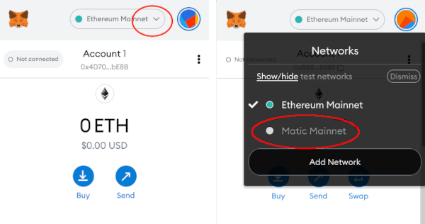
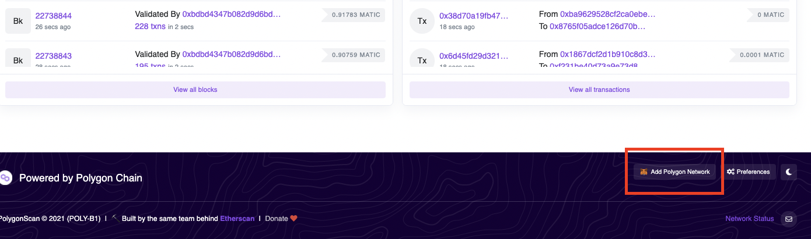
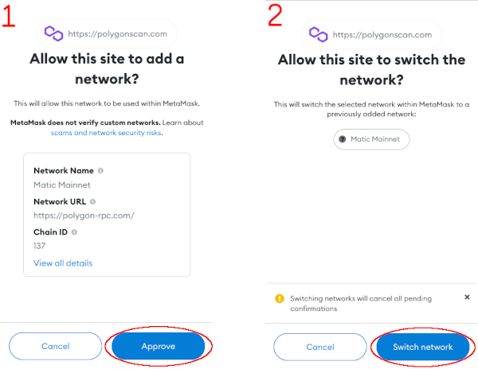

# Introduction to Polygon and MATIC

While ships are minted on Ethereum mainnet (layer 1) so they are available for trading on popular NFT exchanges like OpenSea, all actual gameplay and governance takes place on [Polygon](https://polygon.technology/) (formerly called Matic), an Ethereum sidechain (layer 2). The advantage of Polygon is that transactions are fast and cheap compared to Ethereum mainnet. This means the focus can be on having fun and participating without sweating major gas fees.  

While gas fees are very low on Polygon, you will need to load your wallet with a small amount of MATIC in order to play the game and participate in the DAO. MATIC is the native token for the Polygon network that is used to pay for transactions.

## How do I buy MATIC?

[See: How to Buy MATIC](#how-to-buy-matic)

## How much will each basic game transaction cost?

The most expensive transactions will not be any more than 0.05 MATIC at 100 Gwei gas. Most transactions will be somewhere between 0.01 - 0.02 MATIC. 

## How much MATIC do you recommend starting out with?

10-15 MATIC should be more than enough for a month of play with an active play style.  

## How do I switch between Polygon and Ethereum networks on MetaMask?

 In order to play the game and view your bridged assets you will have to switch your wallet to the Polygon network. In MetaMask, you can switch networks any time by clicking on the name of the network at the top of your MetaMask wallet.

To be able to switch to the Polygon network, it has to be added to MetaMask. If you haven't added Polygon yet:

 [See: How to Add Polygon to MetaMask](#how-to-add-the-polygon-network-to-metamask) 

## Why was Polygon chosen over Layer 2 solutions?

Polygon is the most mature Layer 2 solution available and has the best track record as far as security and dependability are concerned. At the moment, it is both cheaper and faster than other options (especially when it comes to bridging). It was convenient to work with and met our needs really well for what we wanted to accomplish.

The way the contracts are written, it would be possible to switch to another Layer 2 down the road if there were clear cut advantages to doing so. 

# How to Add the Polygon Network to MetaMask

There's two ways to add the Polygon network to MetaMask: using an easy *automatic* method or entering values into MetaMask *manually*.

## Option 1: Automatically Using Polygonscan's One Click Setup Button

- Go to [https://www.polygonscan.com/](https://www.polygonscan.com/)
- Scroll to the bottom of the page and look for the "Add Polygon Network" button with the MetaMask icon, then click on it. 

* When prompted, click on approve to allow the Polygon Network to be added to your MetaMask wallet.

* You will then be asked by MetaMask if you want to switch to the Polygon network, which is up to you.
## Option 2: Enter Values into MetaMask Manually
- If the above step doesn't work for you, you can add Polygon to MetaMask manually in the following guide:

* [Learn how to add Polygon to Metamask manually](https://docs.polygon.technology/docs/develop/metamask/config-polygon-on-metamask/#add-the-polygon-network-manually)

### Need more help on this?
* [Read more information on adding the Polygon Network to Metamask](https://docs.polygon.technology/docs/develop/metamask/config-polygon-on-metamask/)

### Don't have MetaMask?

* [Learn how to install and setup a MetaMask wallet](https://docs.polygon.technology/docs/develop/metamask/hello)

# How to Buy MATIC

- `Prerequisite`: [Add the Polygon network to MetaMask wallet](#how-to-add-the-polygon-network-to-metamask), if you haven't already. 
- `Option 1`: Buy MATIC on an exchange that supports direct withdrawal to the Polygon network, then withdraw to your wallet.
- `Option 2`: Otherwise, buy MATIC on an exchange on Ethereum mainnet, then bridge it to the Polygon network.

MATIC tokens can be purchased from a number of both of centralized exchanges (e.g. Coinbase) and decentralized exchanges (e.g. Uniswap). A full list of exchanges that sell MATIC can be seen here:

* [Full list of exchanges on CoinMarketCap](https://coinmarketcap.com/currencies/polygon/markets/)

## Option 1: Buy From an Exchange That Supports Direct Polygon Withdrawals

Below is an incomplete list of examples of exchanges that *may* support direct Polygon withdrawals, but you must do your own research (DYOR) before making any purchases as this is subject to change at any time, and this should not be an endorsement of any of these exchanges. 

- Moonpay
- Crypto.com
- Kucoin
- Binance (inconsistently available)
- Coinex
- Dharma.io

You must refer to each exchange in terms of how to buy and withdraw MATIC on Polygon, but the process will always end with withdrawing your MATIC to your MetaMask wallet address that has the Polygon network configured. 

## Option 2: Buy MATIC on Any Exchange and Bridge to Polygon

In this case, you simply buy MATIC on any exchange where it is available.

- `Step 1:` Buy MATIC on your exchange of choice. 
- `Step 2:` Withdraw the MATIC to your Ethereum wallet address on the Ethereum network.
- `Step 3:` Use a bridging app to send your MATIC to Polygon. 

### Bridging to Polygon

Bridging is the process of sending a token from Ethereum  to the Polygon, or vice versa. By default, most exchanges only offer Ethereum mainnet withdrawals of MATIC. So in this case you have to send it to your wallet on Ethereum and then bridge to Polygon.

The following are examples of apps that can be used to bridge MATIC to Polygon. Before using any of these tools, please do your own research (DYOR) regarding their current status and safety:

- [Umbria](https://bridge.umbria.network/)
- [Hop](https://hop.exchange/)
- [Hyphen](https://hyphen.biconomy.io/)
- [Polygon Bridge](https://wallet.polygon.technology/bridge) - official Polygon bridge  app, but expensive
