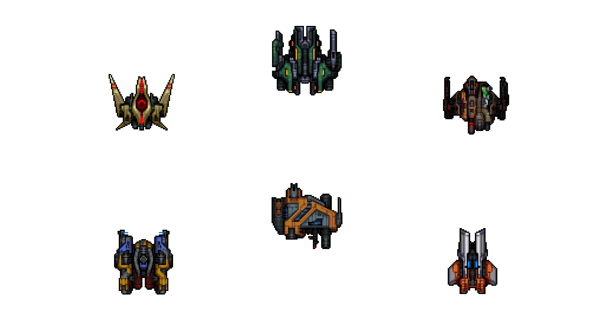
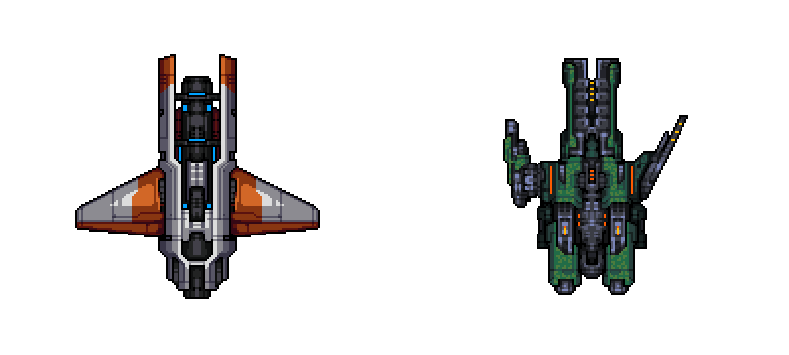
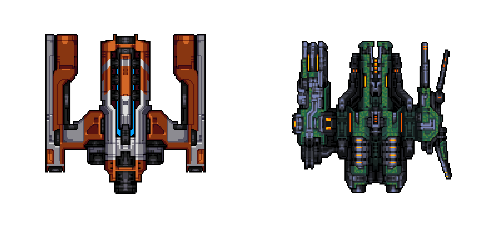

# What is The Citadel?

The Citadel is a 2D multiplayer space exploration strategy game set in a persistent world on the Ethereum blockchain. Players pilot spaceships across a star map to seek out ore in distant asteroid belts as either a fortune-hunting space miner or a cutthroat marauder. The stakes are high, risk is real, and player strategy drives a complex token economy. 

Like many of the games that have come before it, The Citadel uses NFTs to represent game items that interact to generate, claim, steal, burn, and exchange tokens. Unlike many of the games that have come before it, The Citadel expands on current state-of-the art P2E concepts to add staking pools with different risk/reward propositions, limited-resource staking pools, and a fully on-chain real time player positioning system. 

The Citadel also takes inspiration from the decentralization that is commonplace in DeFi projects, adopting a community-first governance model with a true on-chain DAO and reduced owner privileges. Upon the launch of the game, the DAO will be trustlessly handed ownership of the game contracts and the treasury will be funded with a full 70% of the proceeds of the mint. At this point, the team joins the community as fellow players and builders that will continue to co-create the future of The Citadel alongside the community. 

# Message from the Developers

The Citadel is the passion project of an experienced group of developers, artists, and space fans who want to push the limits of what's possible with on-chain games. As dedicated EVE players, it has been our dream to make a space game with a proper economy for a long time. When NFTs emerged as a means of letting players trade their assets freely, we knew it was time to see the vision through. 

This game is our baby, and our sole focus is building it out the best we possibly can. We chose to self fund the initial development of a fully functional game because we want to demonstrate that we're here for the long run.  We understand that perfection from top to bottom is impossible, but we’ve taken special care to solve the problems that have plagued other projects in the space:

- **Playable on mint**: The game can be played immediately after minting a ship. Ships reveal the instant you bridge to Polygon -- no waiting.   

- **Code audit**: We have partnered with Solidity Finance to professionally audit all contracts to the same standard and rigor as any serious DeFi product. The audit will be 100% complete and passed prior to mint. All future updates will be subject to additional auditing as part of our on-going partnership. 

- **Economic design audit:** We have also partnered with Machinations who utilize their cutting-edge Monte Carlo simulation technology and professional economic expertise to model and audit our economic design. After several months of testing and revising the model, we are now the first on-chain game to receive their game economy health verification seal. 

- **Community owned:** To ensure the community's best interests are protected, we’ve designed all of our contracts so that we can relinquish upgrade permission and AccessControl admin roles to the DAO, while still retaining non-admin permissions. This allows us to add surprises to the game, but also gives the DAO the power to remove those rights, as well as our portion of royalties, if the community chooses.

- **L2 Integration:** We’ve instituted a Layer 1 ⥦ Layer 2 bridging system on Polygon. This makes gameplay ~10 times faster and hundreds of times cheaper, without sacrificing native Layer 1 tradability. To keep voting accessible and inexpensive, governance happens on Layer 2, but can trigger effects even on Layer 1 through a privileged governance tunnel.

- **Flashbot mitigation:** Randoms are generated through Chainlink VRF's push system per-request. This eliminates flashbots vulnerabilities by definition.

# Game Synopsis

Welcome to The Citadel. Your ships mint into this station and remain safe as long as they are here. You'll find that your ship is marked as either a miner or a marauder. This determines your career path for the game.

## Miners

As a miner, you will make your living by warping to asteroid belts and mining them for ore. As new asteroid belts with different ore densities are discovered and existing asteroids' resources are expended, you'll face the choice of whether to punch in new navigation coordinates and travel on or to return to The Citadel to haul your ore back for processing and upgrade your ship. Your decisions must be made carefully and are shaped by your ship's speed, fuel efficiency, mining system, as well as your own understanding of risk.

## Marauders

As a marauder, you will make ends meet by robbing miners and utilizing systemic corruption. After traveling to an asteroid belt and stationing your ship, you will be inducted into the local crime ring. By colluding with local transport ship staff, you will siphon off some of the miners' hard-earned ore for yourself. Additionally, you will assist in the ring's attempts to gun down returning miners who refuse to pay their protection tribute, granting you a much more significant portion of their ore.

Regardless of your career path, you will face choices as you select where to travel, when to perform upgrades, and how to increase your wealth relative to your fellow pilots. To succeed you will need take into account the strengths and weaknesses of the ship you're piloting, your tolerance for risk, and your limitations as a player.

# Spaceships

Ships belong to one of three distinct classes. Each is available to both miner and marauder pilots, and issuance is decided randomly by The Citadel’s technicians. These classes give a ship its purpose and influence its starting traits.

## Classes

### Frigates & Interceptors

These are small, light ships. Generally fuel efficient and fast, they are great for reaching distant belts before other pilots. They are less powerful than the other classes of ships, though, regardless of their career.

### Barges & Cruisers

These are the mid-sized workhorses of any fleet. Their speed, fuel efficiency, and power all sit between those of the other classes. While they may not have any particularly flashy stats, their balance and upgradeability makes them a good fit for most any mission.

### Command & Battleships

These are large, heavy, and powerful. Built to maximize ore yield or attack power at any cost, they are the behemoths of space. However, what they deliver in power, they lack in agility. Even with upgraded propulsion systems, they have little hope of approaching the speed or fuel efficiency of the other classes.

## Designations

Within each class, a ship may fall into one of four build designations: standard, noble, exodus, or officer. A ship's designation determines its rarity, and how its traits compare to those of other ships within the same class.

### Standard

Ships designated as standard have the lowest tier traits and are most common, making up around 60% of the total supply. They serve as daily drivers for most pilots, and provide the most granularity in terms of upgrades.

### Noble

Noble ships with higher tier traits than their standard counterparts, but are less common. Comprising only 30% of the total supply, they are inaccessible to many pilots. For those that are lucky enough to receive them at issue, or to acquire them through trade, they can provide significant benefits.

### Exodus

Exodus ships are anomalous. Their traits far surpass those of standard and noble ships, and often exceed what is legally allowed within The Citadel. These ships are projects the technicians are most proud of, and were made in secret. Exodus ships are top tier, and they certainly look the part.

### Officers

The Citadel has received reports of ship sightings that describe phenomena all but beyond their technicians' comprehension. The ships are described as vastly superior to even the best exodus ships, but sightings are rare and it is assumed there are very few examples of these peculiar craft in operation. Rumors circulate that these are the personal craft of clandestine elites in positions of power, and have thus been designated as officer ships. 

### Ship Manufacturers

Citadel researchers have confirmed the origin of at least six different lines of ships from various manufacturers, although many sightings remain unidentified. The known manufacturers range from government backed corporations with access to cutting edge tech to DIY vessels cobbled together from scrapheaps commonly used in acts of piracy. Examples of every class and designation can found within each line of ships. 

Below is the Citadel's file on all known vessels of a zealous, war-like marauder cult known as the *Singulons*. 

# Regions

In an effort to catalogue how resource availability and the miner-marauder power dynamic vary by location, The Citadel's government has divided the nearby portion of space into five political regions: Frontier, Providence, Ouroboros, Outer Ring, and Abyss. Within each region, it is typical to see belts with similar ore breakdowns, as well as similar crime and corruption rates.

For brevity, the details will be kept for the [yellowpaper](#). In general, as regions get further from outposts, resources get denser and marauders gain power. The Abyss in particular is considered to be extremely problematic, to the point that transport ships are not available at all. Despite the lure of its extremely lucrative resources, all but the most dedicated miners will refuse to approach it.

# Asteroid Belts

## Ore

The Citadel's economy revolves around ore. Because asteroids are the only source of ore that's been discovered so far, The Citadel's government scientists spend considerable time attempting to find them. As each belt is discovered, they begin the process of scanning and disclosing its ore densities. This analysis takes a while, but it provides invaluable information to miners. Not all belts are equal, and those with higher densities of valuable ore provide better opportunities. We present the ores that have been discovered so far:

## Drilling

As a miner, when you lift your ship's drills, you will find a single type of ore. Your odds of which are determined by the belt’s densities. As you drill into a belt over time, you increase your earnings, but deplete the belt’s resources in the process. Each belt has a limited capacity, and once it is reached, the belt ceases to exist. Capacity is global per belt and varies directly with the power of the ships mining it. This means that more powerful ships will deplete a belt quicker, and that players will need to consider how other players’ operations may impact their own.

# Risk

> One of the characteristics of truly owning something is that you can potentially lose it.

-- <a href="https://hackernoon.com/how-to-build-a-robust-game-economy-lessons-from-one-of-the-worlds-longest-running-mmos-426f8fd94f6d">Adora Goh</a>

## As a Miner

When completing their mining operations, miners must either call a transport ship or return to The Citadel themselves to bank their ore.

### The Safe Option: Pay the Corruption Tax

In the regions where they are available, transport ships are able to deposit ore immediately on behalf of miners. However, their captains are corrupt and will immediately deduct a portion of the ore earnings and split it among the marauders at that belt, if there are any. Corruption varies from belt to belt, but is generally higher in more distant regions. If there are no marauders at a belt when a miner claims, all funds are deposited immediately, without any deduction.

### The Risky Option: Take a Perilous Journey

When transport ships are not available, or to avoid feeding into the corrupt system, a miner may choose to return to The Citadel themselves in order to deposit their ore. For the most part, miners are successful when choosing this option, but they do have to account for the travel time and fuel involved. Still, if there are marauders at their asteroid belt, there is small chance that they are robbed for a portion of their funds, and a sliver of a chance that their ship is gunned down and destroyed permanently. As with transport ships, the exact odds of each outcome vary by region, and there is no risk at all if the asteroid belt in question is clear of marauders.

## As a Marauder

Each time that ore is allocated to marauders, either through corruption or crime, it is distributed only to marauders at the belt in question. An individual marauder's share of the take is proportional to their ship's attack power. As miners move to avoid resource depletion and leverage new opportunities, marauders will face the decision of whom to follow. Because there is only so much ore to distribute, marauders will also have to consider their ship’s attack power in comparison to the total attack power before traveling.

# Travel & Fuel

Space is vast, and opportunities are all about location. Being in the right place at the right time is key, but it doesn't come for free. In order to pilot your ship to new belts or back to The Citadel, you'll need fuel for your thrusters and patience for the journey. Thankfully, all ships have been equipped with a refinery that converts ore into fuel and a set of thrusters powerful enough to make the distance bearable. Still, the travel time and fuel necessary for a trip will vary directly with distance, as well as a ship's speed and fuel efficiency. The best pilots will plan their travels, weighing opportunities against the time and ore costs of getting there.

# Outposts

As mining operations ventured further out into distant asteroid belts, the Citadel began to deploy mining outposts to support them since returning to the Citadel for refining and resupplying became too costly and time consuming. Outposts provide outer belt miners with shorter return paths for when they decide to forgo a transport ship and take their chances hauling their own ore back for processing. 

## The Brig

In a series of coordinated strikes by marauders, all but one outpost was destroyed. The surviving station was captured intact and retrofitted as an outlaw stronghold. The marauder chieftain in command dubbed the station "The Brig" in honor of The Citadel's holding cells he once managed to escape. After a period of conflict, a ceasefire was reached under the tentative agreement that The Brig would be a neutral safe harbor where mining crews are allowed to bring their ore for processing so long as they abide by the marauder way of doing things. For Outer Ring and Abyss miners who haul their own ore, docking at the Brig is too convenient and profitable to avoid. 

Undeterred, The Citadel continues work on new outposts with more powerful defensive capabilities for deployment in the near future.  

# Upgrades

The stats of your initial ship are up to chance, but there's nothing a little ore can't solve. As you travel and grow your wealth, through legal means or otherwise, you may decide that your ship could use some work. Provided that you return and dock, The Citadel's technicians are happy to offer their skills. Good things take time and labor doesn't come cheap, but your thrusters, guns, and mining equipment can all be upgraded. Still, depending on your ship's category and designation, some upgrades may come easier than others.

## Tier System

To make quotes simpler, The Citadel's technicians have created a set of tiers to describe the complexity of the mining, attack, and propulsion systems on a ship. Depending on a ship's stats, it may initially fall into T0, T1, T2, T3. All systems are upgradeable to T5, but at varying cost. As you ascend through ship tiers, upgrades become more difficult and thus require more time and labor. The timing of your upgrades, the parts that you select, and the degree to which they are improved are all under your control. As the technicians complete their work, your ship's traits will permanently change. You’re advised to consider how you will use your ship to decide which traits to upgrade and by how much.

# Ship Construction Bay

Each ship is built with different traits that define a unique set of tradeoffs. To bolster their strategies and develop new tactics, many pilots will want multiple ships under their command. The Citadel's government understands this, and has instructed their technicians to offer a reserve of additional ships of both new and refurbished models from all manufacturers. 

In an effort to keep the economy stable, The Citadel's government has elected not to set prices. Instead, a blind auction will be held each week where pilots submit sealed bids for the amount of ore they are willing to pay per ship. Only a small number of ships will be offered each week, and each pilot may only bid on up to three ships per auction. This unique auction process will prevent those richest in ore from manipulating the bidding action and ensure all pilots pay the lowest possible price. As a result, the value of a ship is set naturally and dynamically by the community of pilots. 

Of the ore the government receives, 67% will be burnt due to bureaucracy and 33% will be sent to The Citadel's parliament treasury, where all pilots will vote on how it is used or whether it is burnt.

# Governance

Given that pilots are the backbone of The Citadel's economy, it is only right that they have a role in its government and a say over the use of its well funded treasury. Each pilot will be issued one pilot's badge ($BADGE) per ship that they have in play. One badge will correspond to a single vote in The Citadel's parliament, where all proposed changes to ship issuance, belt discovery, region division, taxation, and general gameplay will be heard. Pilots with 5 badges and over will also be granted the privilege of creating proposals themselves. It is extremely important that all pilots participate in governance processes, because The Citadel's parliament retains complete control of all treasury funds and game contracts, and successful proposals will be executed automatically.